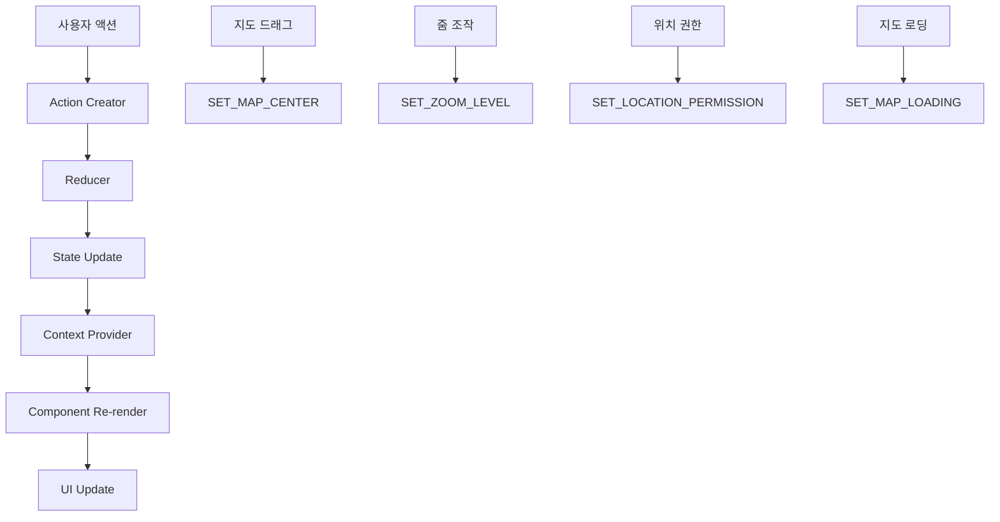
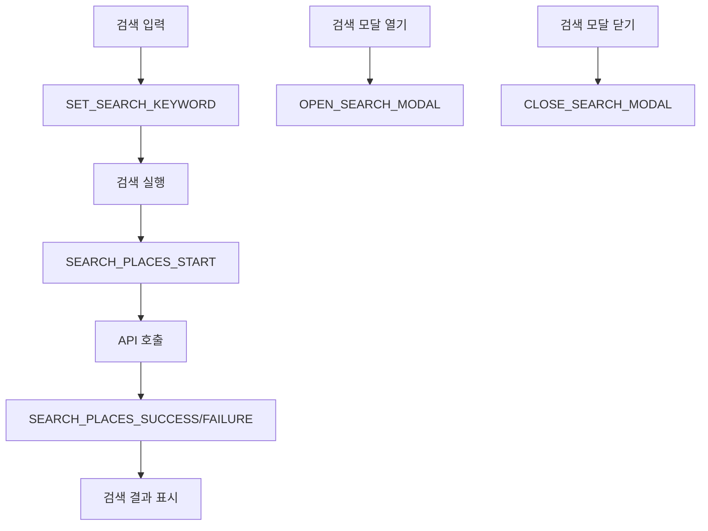
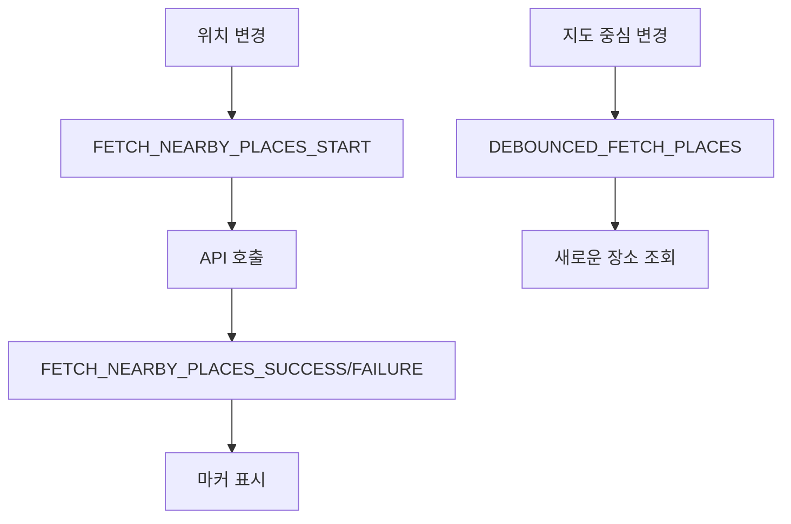
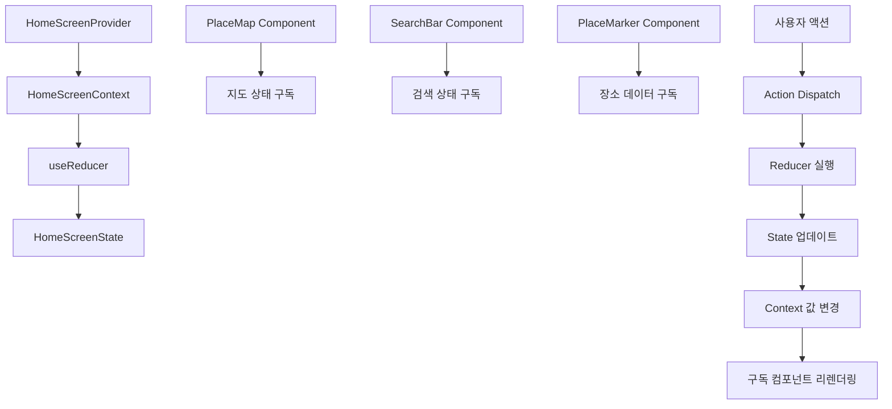
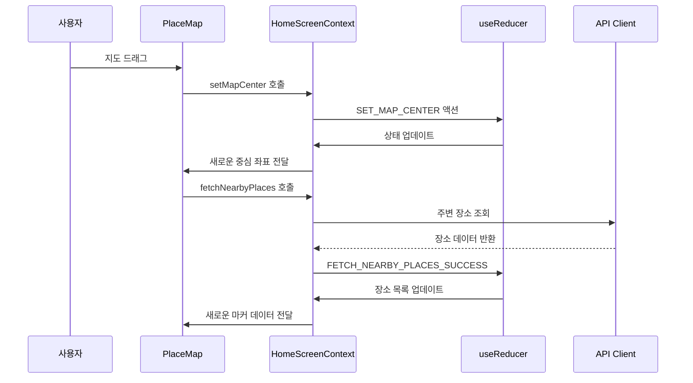
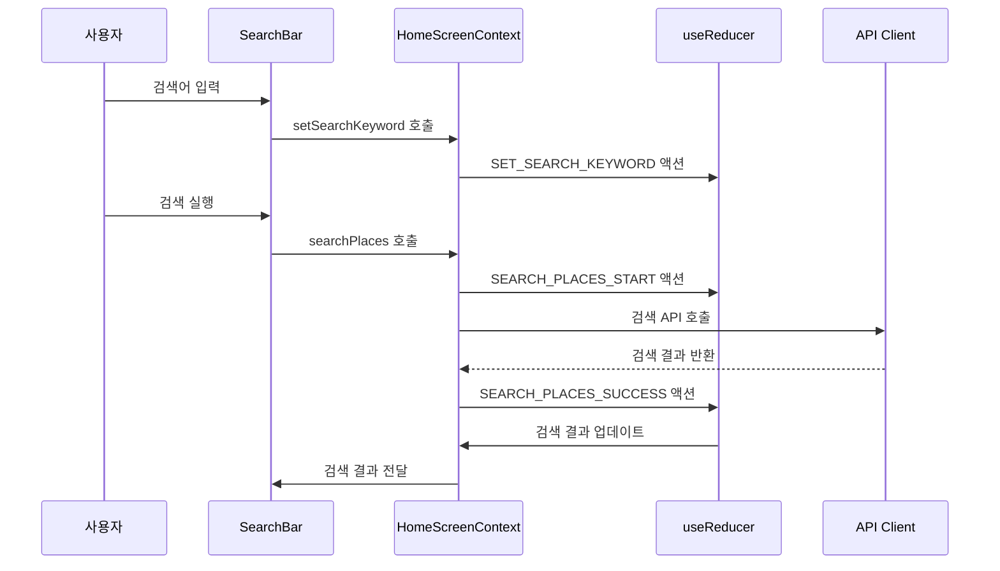

# 홈 화면 상태관리 설계

## 문서 개요
홈 화면에서 지도 기반 장소 탐색을 위한 상태관리 설계입니다. Context + useReducer 패턴을 사용하여 복잡한 상태를 효율적으로 관리합니다.

---

## 1. 관리해야 할 상태 데이터

### 1.1 지도 관련 상태
- **현재 위치**: `{ latitude: number, longitude: number } | null`
- **지도 중심**: `{ lat: number, lng: number }`
- **줌 레벨**: `number`
- **지도 로딩 상태**: `boolean`
- **위치 권한 상태**: `'granted' | 'denied' | 'prompt' | 'error'`

### 1.2 검색 관련 상태
- **검색 키워드**: `string`
- **검색 결과**: `Place[]`
- **검색 로딩 상태**: `boolean`
- **검색 에러**: `string | null`

### 1.3 장소 데이터 상태
- **주변 장소 목록**: `Place[]`
- **장소 로딩 상태**: `boolean`
- **장소 에러**: `string | null`

### 1.4 UI 상태
- **검색 모달 열림**: `boolean`
- **로딩 스피너 표시**: `boolean`

---

## 2. 화면상에 보여지는 데이터지만 상태가 아닌 것

### 2.1 계산된 값들
- **마커 위치**: 장소 데이터에서 계산
- **거리 정보**: 현재 위치와 장소 위치로 계산
- **필터링된 장소**: 리뷰 존재 여부로 필터링

### 2.2 외부 데이터
- **지도 SDK 인스턴스**: 외부 라이브러리에서 관리
- **Geolocation API**: 브라우저 API에서 관리

---

## 3. 상태 변경 조건 및 화면 변화

| 상태 | 변경 조건 | 화면 변화 |
|------|-----------|-----------|
| `currentLocation` | 위치 권한 허용/거부 | 현재 위치 마커 표시/숨김 |
| `mapCenter` | 지도 드래그/줌 | 지도 중심 이동 |
| `zoomLevel` | 지도 줌 조작 | 지도 확대/축소 |
| `mapLoading` | 지도 SDK 로딩 | 로딩 스피너 표시/숨김 |
| `locationPermission` | 위치 권한 요청 결과 | 권한 상태에 따른 UI 표시 |
| `searchKeyword` | 검색 입력 | 검색 바 값 변경 |
| `searchResults` | 검색 API 응답 | 검색 결과 리스트 표시 |
| `searchLoading` | 검색 API 호출 | 검색 로딩 인디케이터 |
| `nearbyPlaces` | 주변 장소 API 응답 | 지도 마커 표시 |
| `placesLoading` | 주변 장소 API 호출 | 장소 로딩 스피너 |
| `searchModalOpen` | 검색 실행/닫기 | 검색 모달 표시/숨김 |

---

## 4. Flux 패턴 시각화

### 4.1 지도 상태 관리 플로우



### 4.2 검색 상태 관리 플로우



### 4.3 장소 데이터 상태 관리 플로우



---

## 5. Context 구조 및 노출 변수/함수

### 5.1 HomeScreenContext 구조

```typescript
interface HomeScreenContextType {
  // 상태
  state: HomeScreenState;
  
  // 지도 관련 액션
  setMapCenter: (center: { lat: number; lng: number }) => void;
  setZoomLevel: (level: number) => void;
  setMapLoading: (loading: boolean) => void;
  setLocationPermission: (permission: LocationPermission) => void;
  setCurrentLocation: (location: { lat: number; lng: number } | null) => void;
  
  // 검색 관련 액션
  setSearchKeyword: (keyword: string) => void;
  searchPlaces: (keyword: string) => Promise<void>;
  openSearchModal: () => void;
  closeSearchModal: () => void;
  
  // 장소 데이터 관련 액션
  fetchNearbyPlaces: (center: { lat: number; lng: number }) => Promise<void>;
  clearPlaces: () => void;
  
  // 유틸리티 함수
  resetState: () => void;
}
```

### 5.2 하위 컴포넌트에 노출되는 변수

```typescript
// 지도 컴포넌트에서 사용
const {
  state: { mapCenter, zoomLevel, mapLoading, currentLocation },
  setMapCenter,
  setZoomLevel,
  fetchNearbyPlaces
} = useHomeScreenContext();

// 검색 컴포넌트에서 사용
const {
  state: { searchKeyword, searchResults, searchLoading, searchModalOpen },
  setSearchKeyword,
  searchPlaces,
  openSearchModal,
  closeSearchModal
} = useHomeScreenContext();

// 장소 마커 컴포넌트에서 사용
const {
  state: { nearbyPlaces, placesLoading }
} = useHomeScreenContext();
```

---

## 6. Context 데이터 흐름 시각화

### 6.1 전체 데이터 흐름



### 6.2 지도 상태 관리 흐름



### 6.3 검색 상태 관리 흐름



---

## 7. Action 타입 정의

### 7.1 지도 관련 액션

```typescript
type MapAction =
  | { type: 'SET_MAP_CENTER'; payload: { lat: number; lng: number } }
  | { type: 'SET_ZOOM_LEVEL'; payload: number }
  | { type: 'SET_MAP_LOADING'; payload: boolean }
  | { type: 'SET_LOCATION_PERMISSION'; payload: LocationPermission }
  | { type: 'SET_CURRENT_LOCATION'; payload: { lat: number; lng: number } | null };
```

### 7.2 검색 관련 액션

```typescript
type SearchAction =
  | { type: 'SET_SEARCH_KEYWORD'; payload: string }
  | { type: 'SEARCH_PLACES_START' }
  | { type: 'SEARCH_PLACES_SUCCESS'; payload: Place[] }
  | { type: 'SEARCH_PLACES_FAILURE'; payload: string }
  | { type: 'OPEN_SEARCH_MODAL' }
  | { type: 'CLOSE_SEARCH_MODAL' };
```

### 7.3 장소 데이터 관련 액션

```typescript
type PlacesAction =
  | { type: 'FETCH_NEARBY_PLACES_START' }
  | { type: 'FETCH_NEARBY_PLACES_SUCCESS'; payload: Place[] }
  | { type: 'FETCH_NEARBY_PLACES_FAILURE'; payload: string }
  | { type: 'CLEAR_PLACES' };
```

---

## 8. Reducer 구현 구조

### 8.1 초기 상태

```typescript
const initialState: HomeScreenState = {
  // 지도 상태
  currentLocation: null,
  mapCenter: { lat: 37.5665, lng: 126.9780 }, // 서울시청 기본값
  zoomLevel: 13,
  mapLoading: false,
  locationPermission: 'prompt',
  
  // 검색 상태
  searchKeyword: '',
  searchResults: [],
  searchLoading: false,
  searchError: null,
  searchModalOpen: false,
  
  // 장소 데이터 상태
  nearbyPlaces: [],
  placesLoading: false,
  placesError: null,
  
  // UI 상태
  loading: false
};
```

### 8.2 Reducer 함수 구조

```typescript
function homeScreenReducer(
  state: HomeScreenState,
  action: HomeScreenAction
): HomeScreenState {
  switch (action.type) {
    case 'SET_MAP_CENTER':
      return { ...state, mapCenter: action.payload };
    
    case 'SET_ZOOM_LEVEL':
      return { ...state, zoomLevel: action.payload };
    
    case 'SEARCH_PLACES_START':
      return { 
        ...state, 
        searchLoading: true, 
        searchError: null 
      };
    
    case 'SEARCH_PLACES_SUCCESS':
      return { 
        ...state, 
        searchLoading: false, 
        searchResults: action.payload 
      };
    
    // ... 기타 액션들
    
    default:
      return state;
  }
}
```

---

## 9. 성능 최적화 고려사항

### 9.1 메모이제이션
- `useMemo`로 계산된 값 메모이제이션
- `useCallback`으로 액션 함수 메모이제이션
- `React.memo`로 불필요한 리렌더링 방지

### 9.2 상태 분리
- 지도 상태와 검색 상태를 별도 Context로 분리 고려
- 장소 데이터는 React Query로 관리하여 중복 제거

### 9.3 디바운싱
- 지도 중심 변경 시 주변 장소 조회 디바운싱
- 검색 입력 시 실시간 검색 디바운싱

---

## 10. 테스트 전략

### 10.1 단위 테스트
- Reducer 함수 테스트
- 액션 크리에이터 테스트
- Context 훅 테스트

### 10.2 통합 테스트
- 전체 상태 흐름 테스트
- 컴포넌트 간 상태 공유 테스트

### 10.3 E2E 테스트
- 사용자 시나리오 기반 테스트
- 지도 인터랙션 테스트

---

## 11. 확장성 고려사항

### 11.1 미래 기능 추가
- 즐겨찾기 기능
- 필터링 기능
- 정렬 기능

### 11.2 상태 구조 확장
- 새로운 상태 추가 시 기존 구조 유지
- 액션 타입 확장 가능한 구조

---

## 12. 변경 이력

| 버전 | 날짜 | 작성자 | 변경 내용 |
|------|------|--------|-----------|
| 1.0 | 2025-10-21 | AI Agent | 초기 작성 |

---

**문서 작성 완료**

이 설계는 홈 화면의 복잡한 상태를 효율적으로 관리하기 위한 Context + useReducer 패턴을 기반으로 합니다. 지도, 검색, 장소 데이터의 상태를 명확히 분리하고, 각 상태의 변경 조건과 화면 변화를 체계적으로 정의했습니다.
