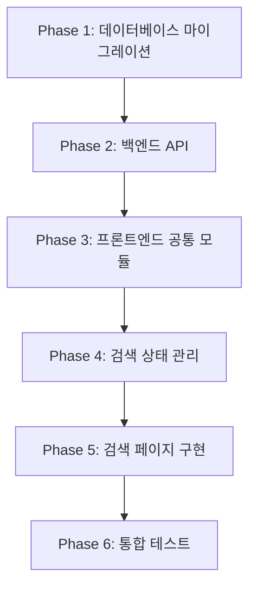

# 2-place-search 페이지 구현 계획

## 문서 개요
본 문서는 장소 검색 결과 페이지(`/search?q={keyword}`)의 단계별 구현 계획을 정의합니다.
PRD, Userflow, Database, Common Modules, Usecase, State 문서를 기반으로 작성되었으며,
**엄밀한 오류 없는 구현**과 **DRY 원칙**을 철저히 준수합니다.

---

## 현재 프로젝트 상태 분석

### 이미 구현된 모듈
✅ **백엔드 기반**
- Hono 앱 구조 (`src/backend/hono/app.ts`)
- 미들웨어 체인 (errorBoundary, withAppContext, withSupabase)
- 공통 응답 헬퍼 (`src/backend/http/response.ts`)
- Supabase 클라이언트 설정

✅ **프론트엔드 기반**
- API 클라이언트 (`src/lib/remote/api-client.ts`)
- React Query Provider 설정 (`src/app/providers.tsx`)
- shadcn-ui 컴포넌트 (card, sheet, button, input, etc.)

### 구현 필요 모듈
❌ **데이터베이스**
- `places` 테이블 생성 마이그레이션
- `reviews` 테이블 생성 마이그레이션
- 시드 데이터 마이그레이션

❌ **백엔드 기능 모듈**
- `src/features/place/backend/` (route, service, schema, error)
- Hono 라우터 등록

❌ **프론트엔드 기능 모듈**
- `src/features/place/hooks/` (검색, 조회 훅)
- `src/features/place/lib/dto.ts` (타입 재노출)
- `src/features/place/components/` (장소 카드 등)

❌ **상태 관리**
- 검색 Context/Store 구현

❌ **페이지 구현**
- `/search` 페이지 구현

---

## 구현 우선순위 및 의존성



---

## Phase 1: 데이터베이스 마이그레이션 (P0)

### 1.1 목표
- `places` 및 `reviews` 테이블 생성
- 시드 데이터 삽입
- 검색 최적화를 위한 인덱스 생성

### 1.2 구현 항목

#### 1.2.1 places 테이블 생성
**파일**: `supabase/migrations/0002_create_places_table.sql`

```sql
-- 기존 example 테이블 관련 정리
DROP TABLE IF EXISTS public.example CASCADE;

-- places 테이블 생성
CREATE TABLE IF NOT EXISTS public.places (
  id UUID PRIMARY KEY DEFAULT gen_random_uuid(),
  name TEXT NOT NULL,
  address TEXT NOT NULL,
  category TEXT NOT NULL,
  latitude NUMERIC(10, 8) NOT NULL,
  longitude NUMERIC(11, 8) NOT NULL,
  created_at TIMESTAMPTZ NOT NULL DEFAULT now()
);

-- 위치 기반 검색 인덱스
CREATE INDEX IF NOT EXISTS idx_places_location
  ON public.places (latitude, longitude);

-- 키워드 검색 인덱스
CREATE INDEX IF NOT EXISTS idx_places_name
  ON public.places (name);

-- RLS 비활성화 (service-role 키 사용)
ALTER TABLE public.places DISABLE ROW LEVEL SECURITY;

-- 테이블 설명
COMMENT ON TABLE public.places IS '장소 정보 테이블';
COMMENT ON COLUMN public.places.id IS '장소 고유 ID';
COMMENT ON COLUMN public.places.name IS '가게명';
COMMENT ON COLUMN public.places.address IS '주소';
COMMENT ON COLUMN public.places.category IS '업종 카테고리';
COMMENT ON COLUMN public.places.latitude IS '위도 (소수점 8자리)';
COMMENT ON COLUMN public.places.longitude IS '경도 (소수점 8자리)';
```

#### 1.2.2 reviews 테이블 생성
**파일**: `supabase/migrations/0003_create_reviews_table.sql`

```sql
-- reviews 테이블 생성
CREATE TABLE IF NOT EXISTS public.reviews (
  id UUID PRIMARY KEY DEFAULT gen_random_uuid(),
  place_id UUID NOT NULL REFERENCES public.places(id) ON DELETE CASCADE,
  author_name TEXT NOT NULL,
  rating INTEGER NOT NULL CHECK (rating >= 1 AND rating <= 5),
  content TEXT NOT NULL CHECK (
    char_length(content) >= 10 AND
    char_length(content) <= 500
  ),
  password_hash TEXT NOT NULL,
  created_at TIMESTAMPTZ NOT NULL DEFAULT now()
);

-- 장소별 리뷰 조회 인덱스
CREATE INDEX IF NOT EXISTS idx_reviews_place_id
  ON public.reviews (place_id);

-- 최신순 정렬 인덱스
CREATE INDEX IF NOT EXISTS idx_reviews_created_at
  ON public.reviews (created_at DESC);

-- RLS 비활성화
ALTER TABLE public.reviews DISABLE ROW LEVEL SECURITY;

-- 테이블 설명
COMMENT ON TABLE public.reviews IS '리뷰 테이블';
COMMENT ON COLUMN public.reviews.id IS '리뷰 고유 ID';
COMMENT ON COLUMN public.reviews.place_id IS '장소 ID (외래키)';
COMMENT ON COLUMN public.reviews.author_name IS '작성자명 (이메일 형식)';
COMMENT ON COLUMN public.reviews.rating IS '평점 (1~5)';
COMMENT ON COLUMN public.reviews.content IS '리뷰 내용 (10~500자)';
COMMENT ON COLUMN public.reviews.password_hash IS 'bcrypt 해싱된 비밀번호';
```

#### 1.2.3 시드 데이터 삽입
**파일**: `supabase/migrations/0004_seed_places.sql`

```sql
-- 시드 장소 데이터
INSERT INTO public.places (id, name, address, category, latitude, longitude)
VALUES
  (
    'aaaaaaaa-aaaa-aaaa-aaaa-aaaaaaaaaaaa',
    '이차돌 신설동점',
    '서울특별시 종로구 종로 405 1층',
    '한식 > 소고기구이',
    37.57410000,
    127.01670000
  ),
  (
    'bbbbbbbb-bbbb-bbbb-bbbb-bbbbbbbbbbbb',
    '이차돌 플러스 돌곶이역점',
    '서울특별시 성북구 돌곶이로 62 1층',
    '한식 > 소고기구이',
    37.59200000,
    127.05200000
  ),
  (
    'cccccccc-cccc-cccc-cccc-cccccccccccc',
    '스타벅스 강남R점',
    '서울특별시 강남구 강남대로 390',
    '카페',
    37.49760000,
    127.02770000
  )
ON CONFLICT (id) DO NOTHING;

-- 시드 리뷰 데이터 (테스트용)
INSERT INTO public.reviews (place_id, author_name, rating, content, password_hash, created_at)
VALUES
  (
    'aaaaaaaa-aaaa-aaaa-aaaa-aaaaaaaaaaaa',
    'test@example.com',
    5,
    '고기 질이 정말 좋아요! 서비스도 친절하고 다음에 또 올게요.',
    '$2a$10$abcdefghijklmnopqrstuvwxyz1234567890',  -- 실제로는 bcrypt 해시 사용
    now() - interval '1 day'
  ),
  (
    'aaaaaaaa-aaaa-aaaa-aaaa-aaaaaaaaaaaa',
    'user2@example.com',
    4,
    '맛있습니다. 조금 기다렸지만 충분히 만족스러웠어요.',
    '$2a$10$abcdefghijklmnopqrstuvwxyz1234567890',
    now() - interval '2 hours'
  ),
  (
    'cccccccc-cccc-cccc-cccc-cccccccccccc',
    'coffee@example.com',
    5,
    '조용하고 커피도 맛있어요. 작업하기 좋은 환경입니다.',
    '$2a$10$abcdefghijklmnopqrstuvwxyz1234567890',
    now() - interval '3 days'
  )
ON CONFLICT DO NOTHING;
```

### 1.3 검증 체크리스트
- [ ] Supabase Dashboard에서 마이그레이션 실행
- [ ] `places` 테이블 생성 확인
- [ ] `reviews` 테이블 생성 확인
- [ ] 인덱스 생성 확인 (`\di` 명령으로 확인)
- [ ] 시드 데이터 삽입 확인
- [ ] 외래키 제약조건 동작 확인

---

## Phase 2: 백엔드 API 구현 (P0)

### 2.1 목표
- 장소 검색 API 엔드포인트 구현
- Zod 스키마 기반 요청/응답 검증
- Supabase 쿼리 최적화

### 2.2 구현 항목

#### 2.2.1 Zod 스키마 정의
**파일**: `src/features/place/backend/schema.ts`

```typescript
import { z } from 'zod';

// 장소 기본 스키마
export const PlaceSchema = z.object({
  id: z.string().uuid(),
  name: z.string(),
  address: z.string(),
  category: z.string(),
  latitude: z.number(),
  longitude: z.number(),
  created_at: z.string().datetime(),
});

export type Place = z.infer<typeof PlaceSchema>;

// 검색 요청 스키마
export const SearchPlacesQuerySchema = z.object({
  q: z.string().min(1, '검색어는 1자 이상이어야 합니다.').max(50, '검색어는 50자를 초과할 수 없습니다.'),
  page: z.coerce.number().int().min(1).default(1),
  limit: z.coerce.number().int().min(1).max(50).default(10),
});

export type SearchPlacesQuery = z.infer<typeof SearchPlacesQuerySchema>;

// 검색 응답 스키마
export const SearchPlacesResponseSchema = z.object({
  places: z.array(PlaceSchema),
  total: z.number().int().min(0),
  hasMore: z.boolean(),
});

export type SearchPlacesResponse = z.infer<typeof SearchPlacesResponseSchema>;

// 장소 상세 응답 스키마 (평균 평점 포함)
export const PlaceDetailSchema = PlaceSchema.extend({
  averageRating: z.number().min(0).max(5),
  reviewCount: z.number().int().min(0),
});

export type PlaceDetail = z.infer<typeof PlaceDetailSchema>;
```

#### 2.2.2 에러 코드 정의
**파일**: `src/features/place/backend/error.ts`

```typescript
export const PlaceErrorCode = {
  PLACE_NOT_FOUND: 'PLACE_NOT_FOUND',
  SEARCH_FAILED: 'SEARCH_FAILED',
  INVALID_QUERY: 'INVALID_QUERY',
  DATABASE_ERROR: 'DATABASE_ERROR',
} as const;

export type PlaceErrorCode = typeof PlaceErrorCode[keyof typeof PlaceErrorCode];

export const PlaceErrorMessage: Record<PlaceErrorCode, string> = {
  PLACE_NOT_FOUND: '장소를 찾을 수 없습니다.',
  SEARCH_FAILED: '검색 중 오류가 발생했습니다.',
  INVALID_QUERY: '검색어를 올바르게 입력해주세요.',
  DATABASE_ERROR: '데이터베이스 오류가 발생했습니다.',
};
```

#### 2.2.3 서비스 레이어 구현
**파일**: `src/features/place/backend/service.ts`

```typescript
import { SupabaseClient } from '@supabase/supabase-js';
import { success, failure } from '@/backend/http/response';
import { PlaceErrorCode, PlaceErrorMessage } from './error';
import type { SearchPlacesQuery } from './schema';

export const PlaceService = {
  /**
   * 키워드로 장소 검색
   */
  async searchPlaces(
    supabase: SupabaseClient,
    query: SearchPlacesQuery
  ) {
    const { q, page, limit } = query;
    const offset = (page - 1) * limit;

    try {
      // 전체 개수 조회
      const { count, error: countError } = await supabase
        .from('places')
        .select('*', { count: 'exact', head: true })
        .ilike('name', `%${q}%`);

      if (countError) {
        console.error('Count query error:', countError);
        return failure(PlaceErrorCode.SEARCH_FAILED, PlaceErrorMessage.SEARCH_FAILED);
      }

      const total = count ?? 0;

      // 페이지별 결과 조회
      const { data, error } = await supabase
        .from('places')
        .select('*')
        .ilike('name', `%${q}%`)
        .order('name')
        .range(offset, offset + limit - 1);

      if (error) {
        console.error('Search query error:', error);
        return failure(PlaceErrorCode.SEARCH_FAILED, PlaceErrorMessage.SEARCH_FAILED);
      }

      if (!data) {
        return failure(PlaceErrorCode.DATABASE_ERROR, PlaceErrorMessage.DATABASE_ERROR);
      }

      // Supabase 타입 안전성을 위해 unknown을 거쳐 캐스팅
      const places = data as unknown as Array<{
        id: string;
        name: string;
        address: string;
        category: string;
        latitude: number;
        longitude: number;
        created_at: string;
      }>;

      const hasMore = total > offset + limit;

      return success({
        places,
        total,
        hasMore,
      });
    } catch (err) {
      console.error('Unexpected error in searchPlaces:', err);
      return failure(PlaceErrorCode.SEARCH_FAILED, PlaceErrorMessage.SEARCH_FAILED);
    }
  },

  /**
   * 장소 상세 조회 (평균 평점 포함)
   */
  async getPlaceById(
    supabase: SupabaseClient,
    placeId: string
  ) {
    try {
      // 장소 정보 + 평균 평점 + 리뷰 개수 조회
      const { data, error } = await supabase
        .from('places')
        .select(`
          *,
          reviews:reviews(rating)
        `)
        .eq('id', placeId)
        .single();

      if (error) {
        console.error('Get place error:', error);
        if (error.code === 'PGRST116') {
          return failure(PlaceErrorCode.PLACE_NOT_FOUND, PlaceErrorMessage.PLACE_NOT_FOUND);
        }
        return failure(PlaceErrorCode.DATABASE_ERROR, PlaceErrorMessage.DATABASE_ERROR);
      }

      if (!data) {
        return failure(PlaceErrorCode.PLACE_NOT_FOUND, PlaceErrorMessage.PLACE_NOT_FOUND);
      }

      // 평균 평점 계산
      const reviews = (data as any).reviews as Array<{ rating: number }> | null;
      const reviewCount = reviews?.length ?? 0;
      const averageRating = reviewCount > 0
        ? reviews!.reduce((sum, r) => sum + r.rating, 0) / reviewCount
        : 0;

      const place = {
        id: data.id,
        name: data.name,
        address: data.address,
        category: data.category,
        latitude: Number(data.latitude),
        longitude: Number(data.longitude),
        created_at: data.created_at,
        averageRating: Math.round(averageRating * 10) / 10, // 소수점 1자리
        reviewCount,
      };

      return success({ place });
    } catch (err) {
      console.error('Unexpected error in getPlaceById:', err);
      return failure(PlaceErrorCode.DATABASE_ERROR, PlaceErrorMessage.DATABASE_ERROR);
    }
  },
};
```

#### 2.2.4 Hono 라우터 구현
**파일**: `src/features/place/backend/route.ts`

```typescript
import { Hono } from 'hono';
import { zValidator } from '@hono/zod-validator';
import { PlaceService } from './service';
import { SearchPlacesQuerySchema } from './schema';
import { success, failure } from '@/backend/http/response';
import type { AppEnv } from '@/backend/hono/context';

export function registerPlaceRoutes(app: Hono<AppEnv>) {
  const placeRouter = new Hono<AppEnv>();

  // GET /api/places/search?q={keyword}&page={page}&limit={limit}
  placeRouter.get(
    '/search',
    zValidator('query', SearchPlacesQuerySchema),
    async (c) => {
      const query = c.req.valid('query');
      const supabase = c.get('supabase');
      const logger = c.get('logger');

      logger.info('Searching places with query:', query);

      const result = await PlaceService.searchPlaces(supabase, query);

      if (!result.ok) {
        return c.json(failure(result.error.code, result.error.message), 500);
      }

      return c.json(success(result.data));
    }
  );

  // GET /api/places/:id
  placeRouter.get('/:id', async (c) => {
    const placeId = c.req.param('id');
    const supabase = c.get('supabase');
    const logger = c.get('logger');

    logger.info('Fetching place detail:', placeId);

    const result = await PlaceService.getPlaceById(supabase, placeId);

    if (!result.ok) {
      const statusCode = result.error.code === 'PLACE_NOT_FOUND' ? 404 : 500;
      return c.json(failure(result.error.code, result.error.message), statusCode);
    }

    return c.json(success(result.data));
  });

  app.route('/api/places', placeRouter);
}
```

#### 2.2.5 Hono 앱에 라우터 등록
**파일**: `src/backend/hono/app.ts` (수정)

```typescript
import { Hono } from 'hono';
import { errorBoundary } from '@/backend/middleware/error';
import { withAppContext } from '@/backend/middleware/context';
import { withSupabase } from '@/backend/middleware/supabase';
import { registerPlaceRoutes } from '@/features/place/backend/route';
import type { AppEnv } from '@/backend/hono/context';

let singletonApp: Hono<AppEnv> | null = null;

export const createHonoApp = () => {
  if (singletonApp) {
    return singletonApp;
  }

  const app = new Hono<AppEnv>();

  app.use('*', errorBoundary());
  app.use('*', withAppContext());
  app.use('*', withSupabase());

  // 장소 라우터 등록
  registerPlaceRoutes(app);

  singletonApp = app;

  return app;
};
```

### 2.3 검증 체크리스트
- [ ] API 엔드포인트 정상 동작 확인
  - [ ] `GET /api/places/search?q=이차돌` → 200 OK
  - [ ] `GET /api/places/search?q=` → 400 Bad Request (검증 에러)
  - [ ] `GET /api/places/search?q=존재하지않는가게` → 200 OK (빈 배열)
  - [ ] `GET /api/places/{valid-id}` → 200 OK
  - [ ] `GET /api/places/{invalid-id}` → 404 Not Found
- [ ] Zod 스키마 검증 동작 확인
- [ ] 에러 응답 포맷 일관성 확인
- [ ] 페이지네이션 동작 확인

---

## Phase 3: 프론트엔드 공통 모듈 (P0)

### 3.1 목표
- DTO 타입 재노출
- React Query 훅 구현
- 공통 컴포넌트 구현

### 3.2 구현 항목

#### 3.2.1 DTO 재노출
**파일**: `src/features/place/lib/dto.ts`

```typescript
// 백엔드 스키마 재노출
export {
  PlaceSchema,
  PlaceDetailSchema,
  SearchPlacesQuerySchema,
  SearchPlacesResponseSchema,
  type Place,
  type PlaceDetail,
  type SearchPlacesQuery,
  type SearchPlacesResponse,
} from '../backend/schema';
```

#### 3.2.2 React Query 훅 구현
**파일**: `src/features/place/hooks/usePlacesSearchQuery.ts`

```typescript
'use client';

import { useQuery } from '@tanstack/react-query';
import { apiClient } from '@/lib/remote/api-client';
import { SearchPlacesResponseSchema, type SearchPlacesQuery } from '../lib/dto';

export function usePlacesSearchQuery(query: SearchPlacesQuery) {
  return useQuery({
    queryKey: ['places', 'search', query],
    queryFn: async () => {
      const { data } = await apiClient.get('/places/search', {
        params: query,
      });

      if (!data.ok) {
        throw new Error(data.error?.message ?? '검색 중 오류가 발생했습니다.');
      }

      // Zod 스키마로 응답 검증
      const validated = SearchPlacesResponseSchema.parse(data.data);
      return validated;
    },
    enabled: query.q.trim().length > 0,
    staleTime: 1000 * 60 * 5, // 5분
    retry: 2,
  });
}
```

**파일**: `src/features/place/hooks/usePlaceQuery.ts`

```typescript
'use client';

import { useQuery } from '@tanstack/react-query';
import { apiClient } from '@/lib/remote/api-client';
import { PlaceDetailSchema } from '../lib/dto';

export function usePlaceQuery(placeId: string) {
  return useQuery({
    queryKey: ['place', placeId],
    queryFn: async () => {
      const { data } = await apiClient.get(`/places/${placeId}`);

      if (!data.ok) {
        throw new Error(data.error?.message ?? '장소 조회 중 오류가 발생했습니다.');
      }

      // Zod 스키마로 응답 검증
      const validated = PlaceDetailSchema.parse(data.data.place);
      return validated;
    },
    enabled: !!placeId,
    staleTime: 1000 * 60 * 10, // 10분
  });
}
```

#### 3.2.3 무한 스크롤 훅
**파일**: `src/features/place/hooks/usePlacesSearchInfiniteQuery.ts`

```typescript
'use client';

import { useInfiniteQuery } from '@tanstack/react-query';
import { apiClient } from '@/lib/remote/api-client';
import { SearchPlacesResponseSchema } from '../lib/dto';

interface UsePlacesSearchInfiniteQueryParams {
  keyword: string;
  limit?: number;
}

export function usePlacesSearchInfiniteQuery({
  keyword,
  limit = 10,
}: UsePlacesSearchInfiniteQueryParams) {
  return useInfiniteQuery({
    queryKey: ['places', 'search', 'infinite', keyword],
    queryFn: async ({ pageParam = 1 }) => {
      const { data } = await apiClient.get('/places/search', {
        params: {
          q: keyword,
          page: pageParam,
          limit,
        },
      });

      if (!data.ok) {
        throw new Error(data.error?.message ?? '검색 중 오류가 발생했습니다.');
      }

      const validated = SearchPlacesResponseSchema.parse(data.data);
      return validated;
    },
    getNextPageParam: (lastPage, allPages) => {
      return lastPage.hasMore ? allPages.length + 1 : undefined;
    },
    initialPageParam: 1,
    enabled: keyword.trim().length > 0,
    staleTime: 1000 * 60 * 5,
  });
}
```

#### 3.2.4 공통 컴포넌트 - 장소 카드
**파일**: `src/features/place/components/place-card.tsx`

```typescript
'use client';

import { Card, CardContent, CardDescription, CardFooter, CardHeader, CardTitle } from '@/components/ui/card';
import { Button } from '@/components/ui/button';
import { Badge } from '@/components/ui/badge';
import { MapPin, Star } from 'lucide-react';
import type { Place } from '../lib/dto';

interface PlaceCardProps {
  place: Place;
  onCardClick?: (place: Place) => void;
  onReviewClick?: (place: Place) => void;
  averageRating?: number;
  reviewCount?: number;
  showReviewButton?: boolean;
}

export function PlaceCard({
  place,
  onCardClick,
  onReviewClick,
  averageRating,
  reviewCount,
  showReviewButton = true,
}: PlaceCardProps) {
  const handleCardClick = () => {
    onCardClick?.(place);
  };

  const handleReviewClick = (e: React.MouseEvent) => {
    e.stopPropagation();
    onReviewClick?.(place);
  };

  return (
    <Card
      className="cursor-pointer transition-shadow hover:shadow-lg"
      onClick={handleCardClick}
    >
      <CardHeader>
        <div className="flex items-start justify-between gap-2">
          <CardTitle className="text-lg font-semibold">{place.name}</CardTitle>
          {averageRating !== undefined && reviewCount !== undefined && reviewCount > 0 && (
            <div className="flex items-center gap-1 text-sm">
              <Star className="h-4 w-4 fill-yellow-400 text-yellow-400" />
              <span className="font-medium">{averageRating.toFixed(1)}</span>
              <span className="text-muted-foreground">({reviewCount})</span>
            </div>
          )}
        </div>
        <CardDescription className="flex items-start gap-1">
          <MapPin className="h-4 w-4 flex-shrink-0 mt-0.5" />
          <span>{place.address}</span>
        </CardDescription>
      </CardHeader>
      <CardContent>
        <Badge variant="secondary">{place.category}</Badge>
      </CardContent>
      {showReviewButton && (
        <CardFooter>
          <Button
            variant="outline"
            size="sm"
            onClick={handleReviewClick}
            className="w-full"
          >
            리뷰 작성
          </Button>
        </CardFooter>
      )}
    </Card>
  );
}
```

#### 3.2.5 공통 컴포넌트 - 빈 상태
**파일**: `src/components/common/empty-state.tsx`

```typescript
'use client';

import { Search } from 'lucide-react';
import { Button } from '@/components/ui/button';

interface EmptyStateProps {
  icon?: React.ReactNode;
  title: string;
  description?: string;
  actionLabel?: string;
  onAction?: () => void;
}

export function EmptyState({
  icon = <Search className="h-12 w-12 text-muted-foreground" />,
  title,
  description,
  actionLabel,
  onAction,
}: EmptyStateProps) {
  return (
    <div className="flex flex-col items-center justify-center gap-4 py-12 text-center">
      {icon}
      <div className="space-y-2">
        <h3 className="text-lg font-semibold">{title}</h3>
        {description && (
          <p className="text-sm text-muted-foreground">{description}</p>
        )}
      </div>
      {actionLabel && onAction && (
        <Button onClick={onAction} variant="outline">
          {actionLabel}
        </Button>
      )}
    </div>
  );
}
```

#### 3.2.6 공통 컴포넌트 - 로딩 스피너
**파일**: `src/components/common/loading-spinner.tsx`

```typescript
'use client';

import { Loader2 } from 'lucide-react';
import { cn } from '@/lib/utils';

interface LoadingSpinnerProps {
  size?: 'sm' | 'md' | 'lg';
  className?: string;
  label?: string;
}

export function LoadingSpinner({
  size = 'md',
  className,
  label,
}: LoadingSpinnerProps) {
  const sizeClasses = {
    sm: 'h-4 w-4',
    md: 'h-8 w-8',
    lg: 'h-12 w-12',
  };

  return (
    <div className={cn('flex flex-col items-center justify-center gap-2', className)}>
      <Loader2 className={cn('animate-spin text-primary', sizeClasses[size])} />
      {label && <p className="text-sm text-muted-foreground">{label}</p>}
    </div>
  );
}
```

### 3.3 검증 체크리스트
- [ ] DTO 타입이 백엔드와 일치하는지 확인
- [ ] React Query 훅 정상 동작 확인
  - [ ] 검색 결과 캐싱 확인
  - [ ] 에러 처리 확인
  - [ ] 로딩 상태 확인
- [ ] 공통 컴포넌트 렌더링 확인
- [ ] 타입 안정성 확인

---

## Phase 4: 검색 상태 관리 (P1)

### 4.1 목표
- Zustand 기반 검색 상태 관리
- URL 쿼리 파라미터와 동기화
- 검색 히스토리 관리

### 4.2 구현 항목

#### 4.2.1 검색 스토어
**파일**: `src/stores/search-store.ts`

```typescript
'use client';

import { create } from 'zustand';

interface SearchState {
  keyword: string;
  setKeyword: (keyword: string) => void;
  clearKeyword: () => void;

  // 검색 히스토리 (로컬 스토리지와 동기화)
  history: string[];
  addToHistory: (keyword: string) => void;
  clearHistory: () => void;

  // 정렬 옵션
  sortOption: 'name' | 'distance' | 'rating';
  setSortOption: (option: 'name' | 'distance' | 'rating') => void;
}

const MAX_HISTORY_SIZE = 10;

export const useSearchStore = create<SearchState>((set) => ({
  keyword: '',
  setKeyword: (keyword) => set({ keyword }),
  clearKeyword: () => set({ keyword: '' }),

  history: [],
  addToHistory: (keyword) =>
    set((state) => {
      const trimmed = keyword.trim();
      if (!trimmed) return state;

      const newHistory = [
        trimmed,
        ...state.history.filter((h) => h !== trimmed),
      ].slice(0, MAX_HISTORY_SIZE);

      // 로컬 스토리지에 저장
      if (typeof window !== 'undefined') {
        localStorage.setItem('search-history', JSON.stringify(newHistory));
      }

      return { history: newHistory };
    }),
  clearHistory: () => {
    if (typeof window !== 'undefined') {
      localStorage.removeItem('search-history');
    }
    set({ history: [] });
  },

  sortOption: 'name',
  setSortOption: (option) => set({ sortOption: option }),
}));

// 로컬 스토리지에서 검색 히스토리 로드 (초기화)
if (typeof window !== 'undefined') {
  const savedHistory = localStorage.getItem('search-history');
  if (savedHistory) {
    try {
      const parsed = JSON.parse(savedHistory) as string[];
      useSearchStore.setState({ history: parsed });
    } catch {
      // 파싱 실패 시 무시
    }
  }
}
```

### 4.3 검증 체크리스트
- [ ] 검색 키워드 상태 관리 확인
- [ ] 검색 히스토리 저장/불러오기 확인
- [ ] 정렬 옵션 변경 확인
- [ ] 여러 컴포넌트에서 상태 공유 확인

---

## Phase 5: 검색 페이지 구현 (P0)

### 5.1 목표
- `/search?q={keyword}` 페이지 구현
- 검색 결과 표시
- 무한 스크롤 구현
- 빈 상태 및 에러 처리

### 5.2 구현 항목

#### 5.2.1 검색 페이지 컴포넌트
**파일**: `src/app/search/page.tsx`

```typescript
'use client';

import { useEffect, Suspense } from 'react';
import { useRouter, useSearchParams } from 'next/navigation';
import { ArrowLeft, X } from 'lucide-react';
import { Button } from '@/components/ui/button';
import { PlaceCard } from '@/features/place/components/place-card';
import { LoadingSpinner } from '@/components/common/loading-spinner';
import { EmptyState } from '@/components/common/empty-state';
import { usePlacesSearchInfiniteQuery } from '@/features/place/hooks/usePlacesSearchInfiniteQuery';
import { useSearchStore } from '@/stores/search-store';
import { useInView } from 'react-intersection-observer';

function SearchPageContent() {
  const router = useRouter();
  const searchParams = useSearchParams();
  const keyword = searchParams.get('q') ?? '';

  const { addToHistory } = useSearchStore();

  const {
    data,
    fetchNextPage,
    hasNextPage,
    isFetchingNextPage,
    isLoading,
    isError,
    error,
  } = usePlacesSearchInfiniteQuery({ keyword });

  const { ref, inView } = useInView({
    threshold: 0,
  });

  // 검색 히스토리에 추가
  useEffect(() => {
    if (keyword.trim()) {
      addToHistory(keyword);
    }
  }, [keyword, addToHistory]);

  // 무한 스크롤 트리거
  useEffect(() => {
    if (inView && hasNextPage && !isFetchingNextPage) {
      fetchNextPage();
    }
  }, [inView, hasNextPage, isFetchingNextPage, fetchNextPage]);

  // 키워드가 없으면 홈으로 리다이렉트
  useEffect(() => {
    if (!keyword.trim()) {
      router.replace('/');
    }
  }, [keyword, router]);

  const handleBack = () => {
    router.back();
  };

  const handlePlaceCardClick = (place: { id: string }) => {
    router.push(`/place/${place.id}`);
  };

  const handleReviewClick = (place: { id: string }) => {
    router.push(`/place/${place.id}/review`);
  };

  // 로딩 상태
  if (isLoading) {
    return (
      <div className="flex min-h-screen items-center justify-center">
        <LoadingSpinner size="lg" label="검색 중..." />
      </div>
    );
  }

  // 에러 상태
  if (isError) {
    return (
      <div className="container mx-auto max-w-4xl px-4 py-8">
        <div className="mb-6 flex items-center justify-between">
          <Button variant="ghost" size="icon" onClick={handleBack}>
            <ArrowLeft className="h-5 w-5" />
          </Button>
          <h1 className="text-2xl font-bold">검색 결과</h1>
          <Button variant="ghost" size="icon" onClick={handleBack}>
            <X className="h-5 w-5" />
          </Button>
        </div>
        <EmptyState
          title="검색 중 오류가 발생했습니다"
          description={error?.message ?? '다시 시도해주세요.'}
          actionLabel="다시 시도"
          onAction={() => window.location.reload()}
        />
      </div>
    );
  }

  const allPlaces = data?.pages.flatMap((page) => page.places) ?? [];
  const totalResults = data?.pages[0]?.total ?? 0;

  // 빈 상태
  if (allPlaces.length === 0) {
    return (
      <div className="container mx-auto max-w-4xl px-4 py-8">
        <div className="mb-6 flex items-center justify-between">
          <Button variant="ghost" size="icon" onClick={handleBack}>
            <ArrowLeft className="h-5 w-5" />
          </Button>
          <h1 className="text-2xl font-bold">검색 결과</h1>
          <Button variant="ghost" size="icon" onClick={handleBack}>
            <X className="h-5 w-5" />
          </Button>
        </div>
        <EmptyState
          title="검색 결과가 없습니다"
          description={`"${keyword}"에 대한 검색 결과를 찾을 수 없습니다.`}
          actionLabel="홈으로 돌아가기"
          onAction={() => router.push('/')}
        />
      </div>
    );
  }

  return (
    <div className="container mx-auto max-w-4xl px-4 py-8">
      {/* 헤더 */}
      <div className="mb-6 flex items-center justify-between">
        <Button variant="ghost" size="icon" onClick={handleBack}>
          <ArrowLeft className="h-5 w-5" />
        </Button>
        <div className="flex-1 text-center">
          <h1 className="text-2xl font-bold">검색 결과</h1>
          <p className="text-sm text-muted-foreground">
            "{keyword}" 검색 결과 {totalResults}개
          </p>
        </div>
        <Button variant="ghost" size="icon" onClick={handleBack}>
          <X className="h-5 w-5" />
        </Button>
      </div>

      {/* 검색 결과 리스트 */}
      <div className="space-y-4">
        {allPlaces.map((place) => (
          <PlaceCard
            key={place.id}
            place={place}
            onCardClick={handlePlaceCardClick}
            onReviewClick={handleReviewClick}
          />
        ))}
      </div>

      {/* 무한 스크롤 트리거 */}
      {hasNextPage && (
        <div ref={ref} className="flex justify-center py-8">
          {isFetchingNextPage ? (
            <LoadingSpinner size="sm" label="추가 결과 로딩 중..." />
          ) : (
            <Button
              variant="outline"
              onClick={() => fetchNextPage()}
            >
              더 보기
            </Button>
          )}
        </div>
      )}

      {/* 모든 결과 로드 완료 */}
      {!hasNextPage && allPlaces.length > 0 && (
        <div className="py-8 text-center text-sm text-muted-foreground">
          모든 검색 결과를 불러왔습니다.
        </div>
      )}
    </div>
  );
}

export default function SearchPage() {
  return (
    <Suspense fallback={<LoadingSpinner size="lg" label="검색 중..." />}>
      <SearchPageContent />
    </Suspense>
  );
}
```

#### 5.2.2 API 클라이언트 수정
**파일**: `src/lib/remote/api-client.ts` (수정)

```typescript
import axios, { isAxiosError } from "axios";

const apiClient = axios.create({
  baseURL: "/api", // NEXT_PUBLIC_API_BASE_URL 대신 /api 사용
  headers: {
    "Content-Type": "application/json",
  },
});

type ErrorPayload = {
  error?: {
    code?: string;
    message?: string;
  };
  message?: string;
};

export const extractApiErrorMessage = (
  error: unknown,
  fallbackMessage = "API request failed."
) => {
  if (isAxiosError(error)) {
    const payload = error.response?.data as ErrorPayload | undefined;

    if (typeof payload?.error?.message === "string") {
      return payload.error.message;
    }

    if (typeof payload?.message === "string") {
      return payload.message;
    }
  }

  if (error instanceof Error && error.message) {
    return error.message;
  }

  return fallbackMessage;
};

export { apiClient, isAxiosError };
```

### 5.3 검증 체크리스트
- [ ] 검색 결과 페이지 정상 렌더링
- [ ] URL 쿼리 파라미터와 동기화 확인
- [ ] 검색 결과 카드 클릭 시 장소 상세로 이동
- [ ] 리뷰 작성 버튼 클릭 시 리뷰 작성 페이지로 이동
- [ ] 무한 스크롤 동작 확인
- [ ] 빈 상태 UI 확인
- [ ] 에러 상태 UI 확인
- [ ] 검색 히스토리 저장 확인
- [ ] 뒤로가기/닫기 버튼 동작 확인

---

## Phase 6: 통합 테스트 및 최적화 (P1)

### 6.1 목표
- 전체 플로우 테스트
- 성능 최적화
- 접근성 개선

### 6.2 테스트 시나리오

#### 6.2.1 성공 시나리오
1. **기본 검색 플로우**
   - [ ] 홈에서 검색 키워드 입력 → 검색 결과 페이지 이동
   - [ ] 검색 결과 표시 확인
   - [ ] 장소 카드 클릭 → 장소 상세 페이지 이동
   - [ ] 뒤로가기 → 검색 결과로 복귀

2. **무한 스크롤**
   - [ ] 검색 결과 10개 이상일 때 스크롤 하단 도달
   - [ ] 추가 결과 자동 로드 확인
   - [ ] 모든 결과 로드 완료 메시지 확인

3. **검색 히스토리**
   - [ ] 검색 후 히스토리에 저장 확인
   - [ ] 로컬 스토리지 저장 확인
   - [ ] 페이지 새로고침 후 히스토리 유지 확인

#### 6.2.2 실패 시나리오
1. **빈 검색 결과**
   - [ ] 존재하지 않는 키워드 검색
   - [ ] 빈 상태 UI 표시 확인
   - [ ] "홈으로 돌아가기" 버튼 동작 확인

2. **네트워크 에러**
   - [ ] 네트워크 연결 끊기
   - [ ] 에러 상태 UI 표시 확인
   - [ ] "다시 시도" 버튼 동작 확인

3. **잘못된 URL**
   - [ ] 키워드 없이 `/search` 접근 → 홈으로 리다이렉트
   - [ ] 특수문자만 입력 → 정상 처리 (빈 결과)

### 6.3 성능 최적화

#### 6.3.1 React Query 캐싱
```typescript
// 캐싱 전략
staleTime: 1000 * 60 * 5, // 5분
cacheTime: 1000 * 60 * 10, // 10분 (gcTime)
```

#### 6.3.2 컴포넌트 메모이제이션
```typescript
// PlaceCard 컴포넌트 메모이제이션
export const PlaceCard = React.memo(PlaceCardComponent);
```

#### 6.3.3 디바운싱 (선택적)
```typescript
// 검색 입력 시 디바운싱 적용
import { useDebouncedValue } from 'react-use';
const [debouncedKeyword] = useDebouncedValue(keyword, 300);
```

### 6.4 접근성 개선

#### 6.4.1 키보드 네비게이션
- [ ] Tab 키로 모든 인터랙티브 요소 접근 가능
- [ ] Enter/Space로 버튼 활성화
- [ ] ESC로 검색 결과 닫기

#### 6.4.2 스크린 리더
- [ ] ARIA 라벨 추가
- [ ] 랜드마크 역할 정의
- [ ] 로딩/에러 상태 aria-live 알림

#### 6.4.3 시각적 접근성
- [ ] 충분한 색상 대비 (WCAG AA)
- [ ] 포커스 인디케이터 명확히 표시
- [ ] 아이콘에 텍스트 라벨 병기

---

## 기존 코드와의 충돌 검토

### 충돌 가능성 분석

#### 1. 백엔드 라우터 등록
**현재**: `registerExampleRoutes(app)` 등록됨
**변경**: `registerPlaceRoutes(app)` 추가
**충돌 여부**: ❌ 없음 (다른 경로)

#### 2. API 클라이언트 baseURL
**현재**: `process.env.NEXT_PUBLIC_API_BASE_URL ?? ""`
**변경**: `/api`로 변경
**충돌 여부**: ⚠️ 주의 필요 (기존 example API 호출에 영향)
**해결 방안**: baseURL을 `/api`로 변경하면 모든 API 호출이 동일한 기준으로 동작

#### 3. 데이터베이스 마이그레이션
**현재**: `0001_create_example_table.sql` 존재
**변경**: places, reviews 테이블 추가
**충돌 여부**: ❌ 없음 (다른 테이블)

#### 4. shadcn-ui 컴포넌트
**현재**: card, sheet, button, input, badge, separator 설치됨
**필요**: skeleton, alert, alert-dialog 추가 필요
**충돌 여부**: ❌ 없음

---

## 추가 shadcn-ui 컴포넌트 설치

```bash
npx shadcn@latest add skeleton
npx shadcn@latest add alert
npx shadcn@latest add alert-dialog
```

---

## DRY 원칙 준수 체크리스트

### 코드 재사용
- [x] DTO 타입을 백엔드에서 정의하고 프론트엔드에서 재노출
- [x] 공통 응답 헬퍼 (`success`, `failure`) 재사용
- [x] React Query 훅으로 데이터 페칭 로직 추상화
- [x] 공통 컴포넌트 (LoadingSpinner, EmptyState, PlaceCard) 재사용

### 중복 제거
- [x] Zod 스키마를 한 곳에서 정의
- [x] 에러 코드 및 메시지를 상수로 관리
- [x] API 클라이언트 싱글턴 사용
- [x] Supabase 클라이언트 미들웨어로 주입

---

## 개발 순서 요약

### Day 1: 백엔드 구현
1. 데이터베이스 마이그레이션 실행
2. Zod 스키마 정의
3. 서비스 레이어 구현
4. Hono 라우터 구현 및 등록
5. API 테스트 (Postman/curl)

### Day 2: 프론트엔드 공통 모듈
1. DTO 재노출
2. React Query 훅 구현
3. 공통 컴포넌트 구현
4. Zustand 검색 스토어 구현
5. 단위 테스트

### Day 3: 페이지 구현 및 통합
1. 검색 페이지 구현
2. API 클라이언트 baseURL 수정
3. 통합 테스트
4. 성능 최적화
5. 접근성 개선

---

## 최종 검증 체크리스트

### 기능 검증
- [ ] 검색 키워드 입력 시 결과 표시
- [ ] 페이지네이션 동작
- [ ] 무한 스크롤 동작
- [ ] 장소 카드 클릭 시 상세 페이지 이동
- [ ] 리뷰 작성 버튼 클릭 시 리뷰 페이지 이동
- [ ] 검색 히스토리 저장/불러오기
- [ ] 빈 상태 UI
- [ ] 에러 상태 UI
- [ ] 뒤로가기/닫기 버튼

### 코드 품질
- [ ] TypeScript 타입 에러 없음
- [ ] ESLint 에러 없음
- [ ] `const` 사용 (재할당 없는 변수)
- [ ] DRY 원칙 준수
- [ ] 컴포넌트 재사용성

### 성능
- [ ] React Query 캐싱 적용
- [ ] 컴포넌트 메모이제이션
- [ ] 무한 스크롤 최적화
- [ ] API 응답 시간 2초 이내

### 접근성
- [ ] 키보드 네비게이션
- [ ] 스크린 리더 지원
- [ ] 색상 대비 (WCAG AA)
- [ ] 포커스 인디케이터

---

## 변경 이력

| 버전 | 날짜 | 작성자 | 변경 내용 |
|------|------|--------|-----------|
| 1.0 | 2025-10-23 | AI Agent | 초기 작성 |

---

**문서 작성 완료**

이 구현 계획은 2-place-search 페이지를 오류 없이 구현하기 위한 단계별 가이드입니다.
모든 단계는 기존 코드베이스와 충돌하지 않도록 설계되었으며, DRY 원칙을 철저히 준수합니다.
