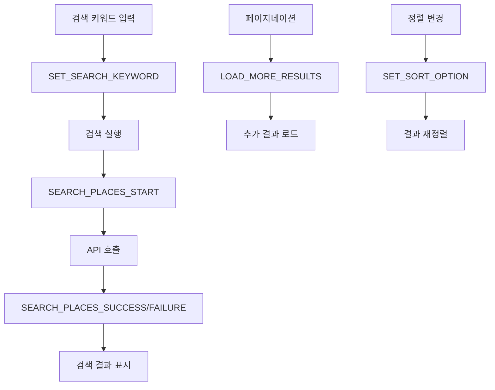
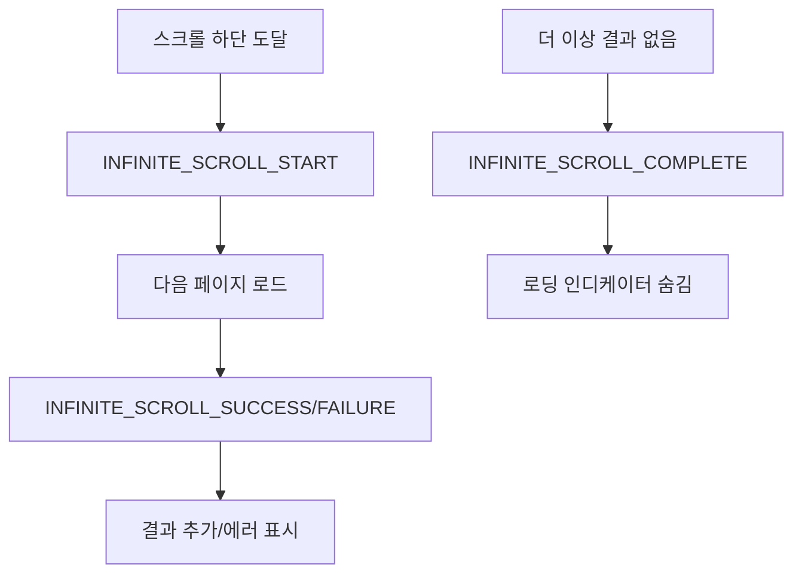
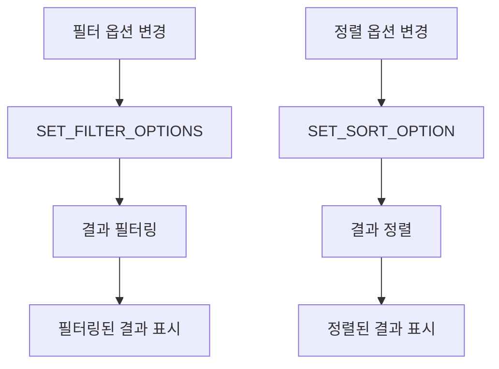
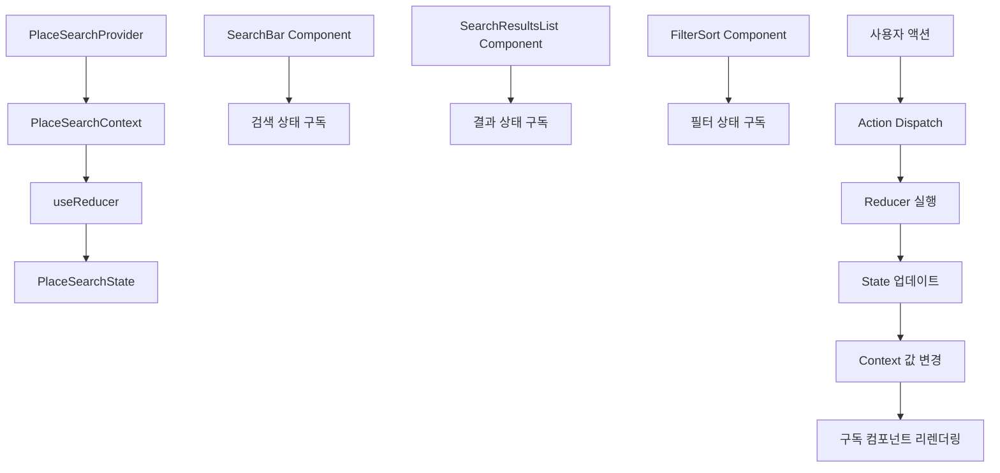
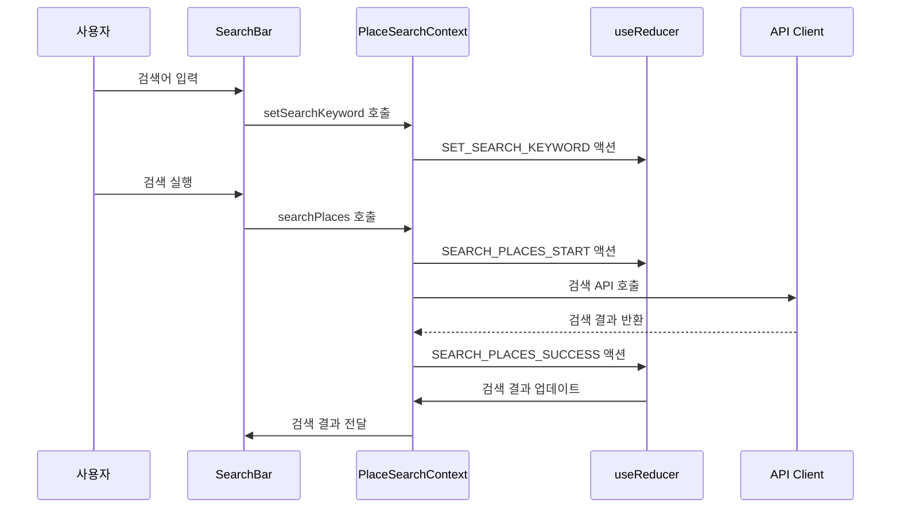
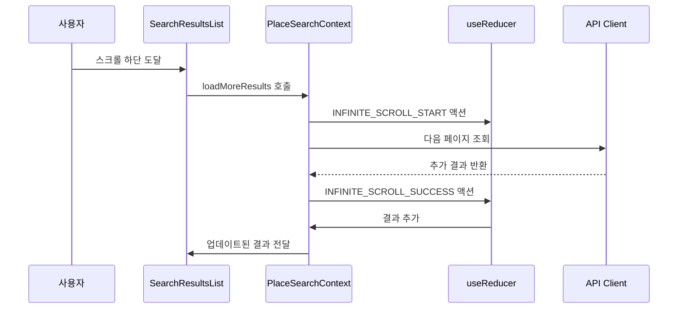

# 장소 검색 결과 페이지 상태관리 설계

## 문서 개요
장소 검색 결과 페이지에서 키워드 기반 검색 및 결과 표시를 위한 상태관리 설계입니다. Context + useReducer 패턴을 사용하여 검색 상태와 결과 데이터를 효율적으로 관리합니다.

---

## 1. 관리해야 할 상태 데이터

### 1.1 검색 관련 상태
- **검색 키워드**: `string`
- **검색 결과**: `Place[]`
- **검색 로딩 상태**: `boolean`
- **검색 에러**: `string | null`
- **검색 히스토리**: `string[]`

### 1.2 페이지네이션 상태
- **현재 페이지**: `number`
- **페이지당 항목 수**: `number`
- **전체 결과 수**: `number`
- **더 많은 결과 존재**: `boolean`
- **무한 스크롤 로딩**: `boolean`

### 1.3 UI 상태
- **검색 모달 열림**: `boolean`
- **정렬 옵션**: `'name' | 'distance' | 'rating'`
- **필터 옵션**: `string[]`
- **선택된 장소**: `Place | null`

### 1.4 사용자 인터랙션 상태
- **스크롤 위치**: `number`
- **키보드 네비게이션**: `boolean`
- **포커스된 장소**: `string | null`

---

## 2. 화면상에 보여지는 데이터지만 상태가 아닌 것

### 2.1 계산된 값들
- **필터링된 결과**: 검색 결과에서 필터 적용
- **정렬된 결과**: 검색 결과에서 정렬 적용
- **페이지별 결과**: 현재 페이지에 해당하는 결과
- **거리 정보**: 사용자 위치와 장소 간 거리

### 2.2 외부 데이터
- **URL 쿼리 파라미터**: Next.js 라우터에서 관리
- **브라우저 히스토리**: 브라우저 API에서 관리

---

## 3. 상태 변경 조건 및 화면 변화

| 상태 | 변경 조건 | 화면 변화 |
|------|-----------|-----------|
| `searchKeyword` | URL 쿼리 파라미터 변경 | 검색 바 값 업데이트 |
| `searchResults` | 검색 API 응답 | 장소 카드 리스트 표시 |
| `searchLoading` | 검색 API 호출 | 로딩 스피너 표시/숨김 |
| `searchError` | API 에러 발생 | 에러 메시지 표시 |
| `currentPage` | 페이지네이션 클릭 | 새로운 결과 로드 |
| `hasMoreResults` | API 응답의 hasMore | 더보기 버튼 표시/숨김 |
| `infiniteScrollLoading` | 무한 스크롤 트리거 | 하단 로딩 인디케이터 |
| `sortOption` | 정렬 옵션 변경 | 결과 리스트 재정렬 |
| `filterOptions` | 필터 옵션 변경 | 결과 리스트 필터링 |
| `selectedPlace` | 장소 카드 클릭 | 선택된 장소 하이라이트 |
| `scrollPosition` | 스크롤 이벤트 | 스크롤 위치 저장 |

---

## 4. Flux 패턴 시각화

### 4.1 검색 상태 관리 플로우



### 4.2 무한 스크롤 상태 관리 플로우



### 4.3 필터링 및 정렬 상태 관리 플로우



---

## 5. Context 구조 및 노출 변수/함수

### 5.1 PlaceSearchContext 구조

```typescript
interface PlaceSearchContextType {
  // 상태
  state: PlaceSearchState;
  
  // 검색 관련 액션
  setSearchKeyword: (keyword: string) => void;
  searchPlaces: (keyword: string) => Promise<void>;
  clearSearch: () => void;
  
  // 페이지네이션 관련 액션
  loadMoreResults: () => Promise<void>;
  setCurrentPage: (page: number) => void;
  resetPagination: () => void;
  
  // 정렬 및 필터링 액션
  setSortOption: (option: SortOption) => void;
  setFilterOptions: (options: string[]) => void;
  clearFilters: () => void;
  
  // UI 상태 액션
  setSelectedPlace: (place: Place | null) => void;
  setScrollPosition: (position: number) => void;
  openSearchModal: () => void;
  closeSearchModal: () => void;
  
  // 유틸리티 함수
  resetState: () => void;
  getFilteredResults: () => Place[];
  getSortedResults: () => Place[];
}
```

### 5.2 하위 컴포넌트에 노출되는 변수

```typescript
// 검색 바 컴포넌트에서 사용
const {
  state: { searchKeyword, searchLoading },
  setSearchKeyword,
  searchPlaces
} = usePlaceSearchContext();

// 검색 결과 리스트 컴포넌트에서 사용
const {
  state: { searchResults, searchLoading, hasMoreResults, infiniteScrollLoading },
  loadMoreResults,
  setSelectedPlace
} = usePlaceSearchContext();

// 필터 및 정렬 컴포넌트에서 사용
const {
  state: { sortOption, filterOptions },
  setSortOption,
  setFilterOptions,
  getFilteredResults,
  getSortedResults
} = usePlaceSearchContext();
```

---

## 6. Context 데이터 흐름 시각화

### 6.1 전체 데이터 흐름



### 6.2 검색 실행 흐름



### 6.3 무한 스크롤 흐름



---

## 7. Action 타입 정의

### 7.1 검색 관련 액션

```typescript
type SearchAction =
  | { type: 'SET_SEARCH_KEYWORD'; payload: string }
  | { type: 'SEARCH_PLACES_START' }
  | { type: 'SEARCH_PLACES_SUCCESS'; payload: { places: Place[]; total: number; hasMore: boolean } }
  | { type: 'SEARCH_PLACES_FAILURE'; payload: string }
  | { type: 'CLEAR_SEARCH' };
```

### 7.2 페이지네이션 관련 액션

```typescript
type PaginationAction =
  | { type: 'SET_CURRENT_PAGE'; payload: number }
  | { type: 'LOAD_MORE_RESULTS_START' }
  | { type: 'LOAD_MORE_RESULTS_SUCCESS'; payload: { places: Place[]; hasMore: boolean } }
  | { type: 'LOAD_MORE_RESULTS_FAILURE'; payload: string }
  | { type: 'RESET_PAGINATION' };
```

### 7.3 정렬 및 필터링 액션

```typescript
type FilterSortAction =
  | { type: 'SET_SORT_OPTION'; payload: SortOption }
  | { type: 'SET_FILTER_OPTIONS'; payload: string[] }
  | { type: 'CLEAR_FILTERS' };
```

### 7.4 UI 상태 액션

```typescript
type UIAction =
  | { type: 'SET_SELECTED_PLACE'; payload: Place | null }
  | { type: 'SET_SCROLL_POSITION'; payload: number }
  | { type: 'OPEN_SEARCH_MODAL' }
  | { type: 'CLOSE_SEARCH_MODAL' };
```

---

## 8. Reducer 구현 구조

### 8.1 초기 상태

```typescript
const initialState: PlaceSearchState = {
  // 검색 상태
  searchKeyword: '',
  searchResults: [],
  searchLoading: false,
  searchError: null,
  searchHistory: [],
  
  // 페이지네이션 상태
  currentPage: 1,
  pageSize: 10,
  totalResults: 0,
  hasMoreResults: false,
  infiniteScrollLoading: false,
  
  // 정렬 및 필터링 상태
  sortOption: 'name',
  filterOptions: [],
  
  // UI 상태
  searchModalOpen: false,
  selectedPlace: null,
  scrollPosition: 0,
  
  // 사용자 인터랙션 상태
  keyboardNavigation: false,
  focusedPlace: null
};
```

### 8.2 Reducer 함수 구조

```typescript
function placeSearchReducer(
  state: PlaceSearchState,
  action: PlaceSearchAction
): PlaceSearchState {
  switch (action.type) {
    case 'SET_SEARCH_KEYWORD':
      return { ...state, searchKeyword: action.payload };
    
    case 'SEARCH_PLACES_START':
      return { 
        ...state, 
        searchLoading: true, 
        searchError: null,
        currentPage: 1
      };
    
    case 'SEARCH_PLACES_SUCCESS':
      return { 
        ...state, 
        searchLoading: false, 
        searchResults: action.payload.places,
        totalResults: action.payload.total,
        hasMoreResults: action.payload.hasMore
      };
    
    case 'LOAD_MORE_RESULTS_SUCCESS':
      return { 
        ...state, 
        infiniteScrollLoading: false,
        searchResults: [...state.searchResults, ...action.payload.places],
        hasMoreResults: action.payload.hasMore,
        currentPage: state.currentPage + 1
      };
    
    // ... 기타 액션들
    
    default:
      return state;
  }
}
```

---

## 9. 성능 최적화 고려사항

### 9.1 메모이제이션
- `useMemo`로 필터링/정렬된 결과 메모이제이션
- `useCallback`으로 액션 함수 메모이제이션
- `React.memo`로 불필요한 리렌더링 방지

### 9.2 가상화
- 대량의 검색 결과에 대해 가상 스크롤 적용
- `react-window` 또는 `react-virtualized` 사용

### 9.3 디바운싱
- 검색 입력 시 실시간 검색 디바운싱
- 스크롤 이벤트 디바운싱

### 9.4 캐싱
- 검색 결과 캐싱으로 중복 요청 방지
- React Query와 연동하여 서버 상태 관리

---

## 10. 테스트 전략

### 10.1 단위 테스트
- Reducer 함수 테스트
- 액션 크리에이터 테스트
- Context 훅 테스트

### 10.2 통합 테스트
- 검색 플로우 테스트
- 페이지네이션 테스트
- 필터링/정렬 테스트

### 10.3 E2E 테스트
- 사용자 검색 시나리오 테스트
- 무한 스크롤 테스트

---

## 11. 확장성 고려사항

### 11.1 미래 기능 추가
- 검색 제안 기능
- 즐겨찾기 기능
- 검색 결과 저장 기능

### 11.2 상태 구조 확장
- 새로운 필터 옵션 추가
- 정렬 옵션 확장
- 검색 히스토리 관리

---

## 12. 변경 이력

| 버전 | 날짜 | 작성자 | 변경 내용 |
|------|------|--------|-----------|
| 1.0 | 2025-10-21 | AI Agent | 초기 작성 |

---

**문서 작성 완료**

이 설계는 장소 검색 결과 페이지의 복잡한 상태를 효율적으로 관리하기 위한 Context + useReducer 패턴을 기반으로 합니다. 검색, 페이지네이션, 필터링, 정렬의 상태를 명확히 분리하고, 각 상태의 변경 조건과 화면 변화를 체계적으로 정의했습니다.
