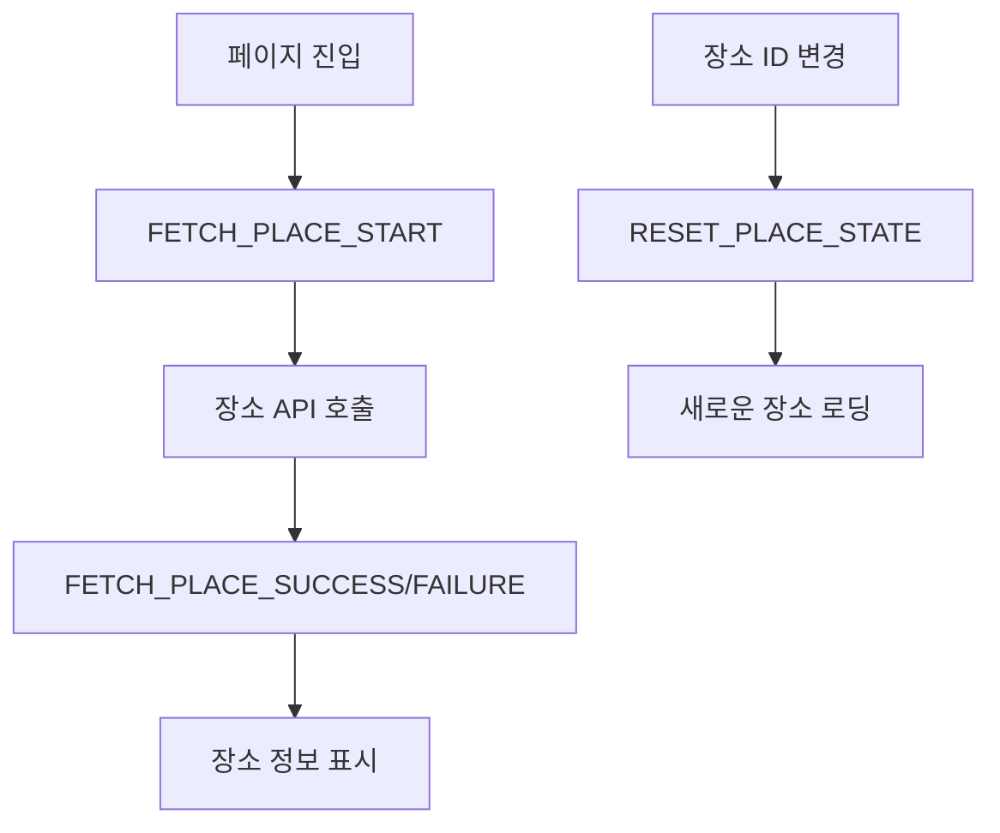
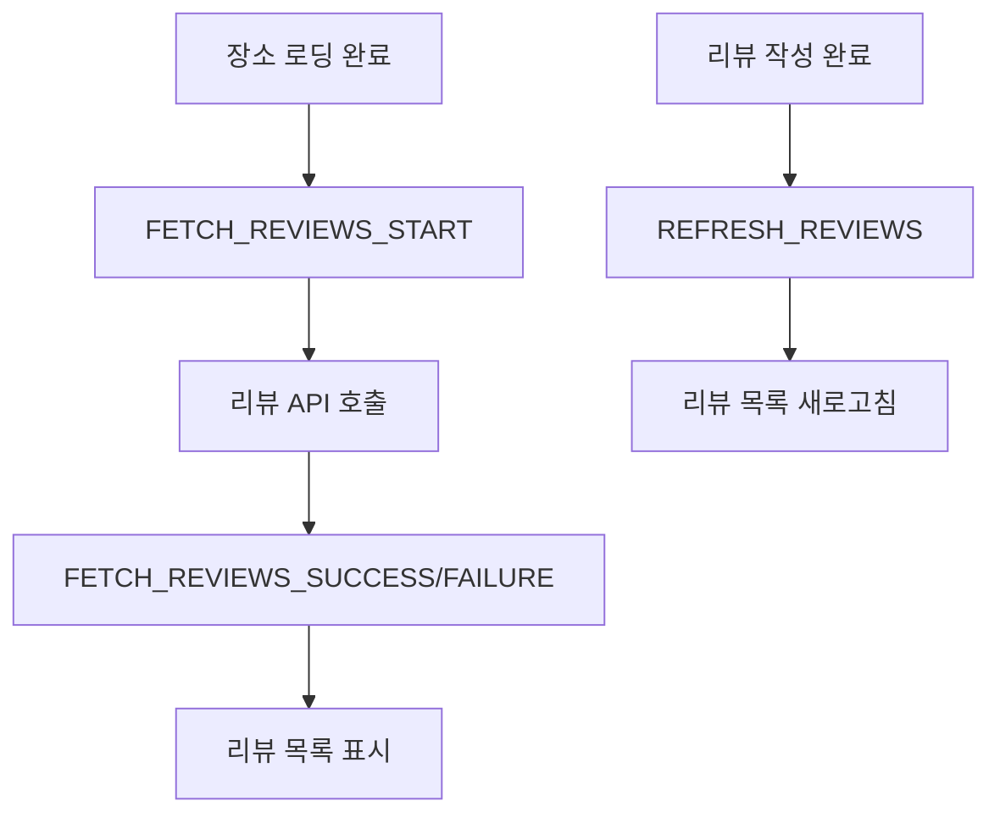
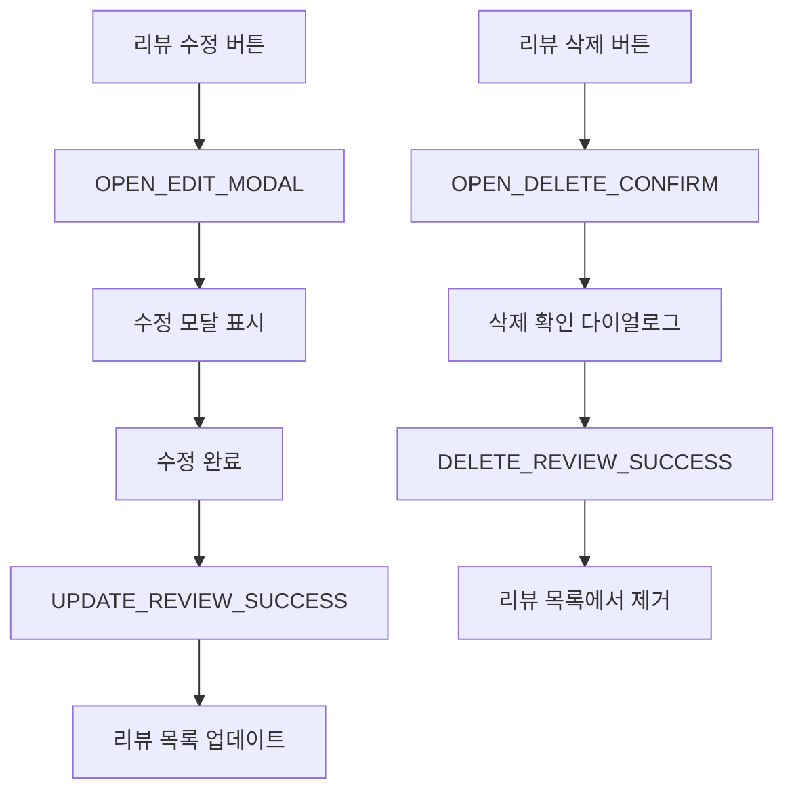
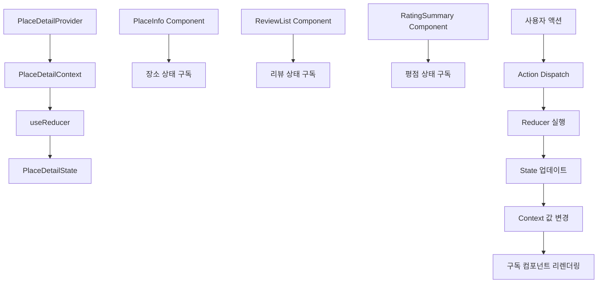
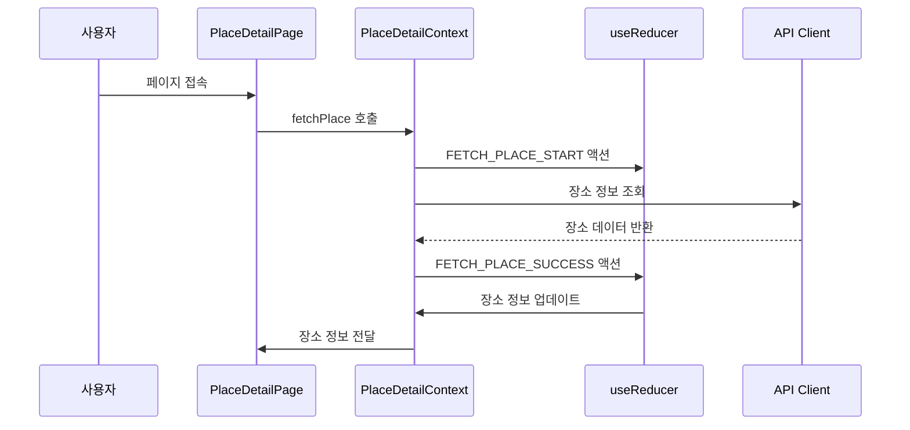
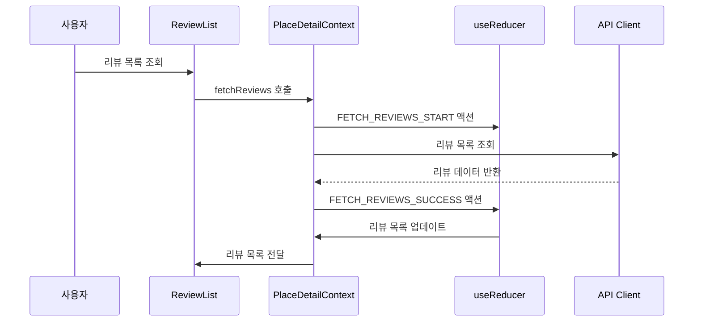
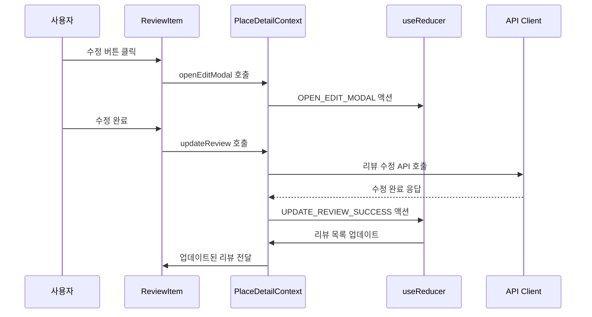

# 장소 상세 페이지 상태관리 설계

## 문서 개요
장소 상세 페이지에서 장소 정보 조회 및 리뷰 목록 표시를 위한 상태관리 설계입니다. Context + useReducer 패턴을 사용하여 장소 데이터와 리뷰 데이터를 효율적으로 관리합니다.

---

## 1. 관리해야 할 상태 데이터

### 1.1 장소 정보 상태
- **장소 데이터**: `Place | null`
- **장소 로딩 상태**: `boolean`
- **장소 에러**: `string | null`
- **장소 ID**: `string`

### 1.2 리뷰 관련 상태
- **리뷰 목록**: `Review[]`
- **리뷰 로딩 상태**: `boolean`
- **리뷰 에러**: `string | null`
- **리뷰 페이지네이션**: `{ currentPage: number; hasMore: boolean }`

### 1.3 평점 관련 상태
- **평균 평점**: `number`
- **리뷰 개수**: `number`
- **평점 분포**: `{ [rating: number]: number }`

### 1.4 UI 상태
- **리뷰 작성 모달**: `boolean`
- **리뷰 수정 모달**: `boolean`
- **리뷰 삭제 확인**: `boolean`
- **선택된 리뷰**: `Review | null`

### 1.5 사용자 인터랙션 상태
- **스크롤 위치**: `number`
- **리뷰 필터**: `'all' | 'recent' | 'high-rating' | 'low-rating'`
- **리뷰 정렬**: `'newest' | 'oldest' | 'highest' | 'lowest'`

---

## 2. 화면상에 보여지는 데이터지만 상태가 아닌 것

### 2.1 계산된 값들
- **평균 평점**: 리뷰 데이터에서 계산
- **리뷰 개수**: 리뷰 배열 길이
- **평점 분포**: 리뷰 데이터에서 집계
- **필터링된 리뷰**: 리뷰 목록에서 필터 적용
- **정렬된 리뷰**: 리뷰 목록에서 정렬 적용

### 2.2 외부 데이터
- **URL 파라미터**: Next.js 라우터에서 관리
- **브라우저 히스토리**: 브라우저 API에서 관리

---

## 3. 상태 변경 조건 및 화면 변화

| 상태 | 변경 조건 | 화면 변화 |
|------|-----------|-----------|
| `placeData` | 장소 API 응답 | 장소 정보 카드 표시 |
| `placeLoading` | 장소 API 호출 | 장소 로딩 스피너 표시/숨김 |
| `placeError` | 장소 API 에러 | 에러 메시지 표시 |
| `reviews` | 리뷰 API 응답 | 리뷰 리스트 표시 |
| `reviewsLoading` | 리뷰 API 호출 | 리뷰 로딩 스피너 표시/숨김 |
| `reviewsError` | 리뷰 API 에러 | 리뷰 에러 메시지 표시 |
| `averageRating` | 리뷰 데이터 계산 | 평점 요약 영역 업데이트 |
| `reviewCount` | 리뷰 데이터 계산 | 리뷰 개수 표시 |
| `reviewModal` | 리뷰 작성 버튼 클릭 | 리뷰 작성 모달 표시/숨김 |
| `editModal` | 리뷰 수정 버튼 클릭 | 리뷰 수정 모달 표시/숨김 |
| `deleteConfirm` | 리뷰 삭제 버튼 클릭 | 삭제 확인 다이얼로그 표시/숨김 |
| `selectedReview` | 리뷰 카드 클릭 | 선택된 리뷰 하이라이트 |
| `reviewFilter` | 필터 옵션 변경 | 리뷰 리스트 필터링 |
| `reviewSort` | 정렬 옵션 변경 | 리뷰 리스트 재정렬 |

---

## 4. Flux 패턴 시각화

### 4.1 장소 정보 로딩 플로우



### 4.2 리뷰 데이터 로딩 플로우



### 4.3 리뷰 수정/삭제 플로우



---

## 5. Context 구조 및 노출 변수/함수

### 5.1 PlaceDetailContext 구조

```typescript
interface PlaceDetailContextType {
  // 상태
  state: PlaceDetailState;
  
  // 장소 정보 관련 액션
  fetchPlace: (placeId: string) => Promise<void>;
  clearPlace: () => void;
  
  // 리뷰 관련 액션
  fetchReviews: (placeId: string, page?: number) => Promise<void>;
  loadMoreReviews: () => Promise<void>;
  refreshReviews: () => Promise<void>;
  
  // 리뷰 수정/삭제 액션
  updateReview: (reviewId: string, data: UpdateReviewData) => Promise<void>;
  deleteReview: (reviewId: string, password: string) => Promise<void>;
  
  // UI 상태 액션
  openReviewModal: () => void;
  closeReviewModal: () => void;
  openEditModal: (review: Review) => void;
  closeEditModal: () => void;
  openDeleteConfirm: (review: Review) => void;
  closeDeleteConfirm: () => void;
  
  // 필터링 및 정렬 액션
  setReviewFilter: (filter: ReviewFilter) => void;
  setReviewSort: (sort: ReviewSort) => void;
  clearFilters: () => void;
  
  // 유틸리티 함수
  resetState: () => void;
  getFilteredReviews: () => Review[];
  getSortedReviews: () => Review[];
  getAverageRating: () => number;
  getReviewCount: () => number;
}
```

### 5.2 하위 컴포넌트에 노출되는 변수

```typescript
// 장소 정보 컴포넌트에서 사용
const {
  state: { placeData, placeLoading, placeError },
  fetchPlace
} = usePlaceDetailContext();

// 리뷰 목록 컴포넌트에서 사용
const {
  state: { reviews, reviewsLoading, reviewsError, hasMoreReviews },
  loadMoreReviews,
  getFilteredReviews,
  getSortedReviews
} = usePlaceDetailContext();

// 평점 요약 컴포넌트에서 사용
const {
  state: { averageRating, reviewCount },
  getAverageRating,
  getReviewCount
} = usePlaceDetailContext();

// 리뷰 수정/삭제 컴포넌트에서 사용
const {
  state: { editModal, deleteConfirm, selectedReview },
  openEditModal,
  closeEditModal,
  openDeleteConfirm,
  closeDeleteConfirm,
  updateReview,
  deleteReview
} = usePlaceDetailContext();
```

---

## 6. Context 데이터 흐름 시각화

### 6.1 전체 데이터 흐름



### 6.2 장소 정보 로딩 흐름



### 6.3 리뷰 목록 로딩 흐름



### 6.4 리뷰 수정 흐름



---

## 7. Action 타입 정의

### 7.1 장소 정보 관련 액션

```typescript
type PlaceAction =
  | { type: 'FETCH_PLACE_START' }
  | { type: 'FETCH_PLACE_SUCCESS'; payload: Place }
  | { type: 'FETCH_PLACE_FAILURE'; payload: string }
  | { type: 'CLEAR_PLACE' }
  | { type: 'RESET_PLACE_STATE' };
```

### 7.2 리뷰 관련 액션

```typescript
type ReviewAction =
  | { type: 'FETCH_REVIEWS_START' }
  | { type: 'FETCH_REVIEWS_SUCCESS'; payload: { reviews: Review[]; hasMore: boolean } }
  | { type: 'FETCH_REVIEWS_FAILURE'; payload: string }
  | { type: 'LOAD_MORE_REVIEWS_START' }
  | { type: 'LOAD_MORE_REVIEWS_SUCCESS'; payload: { reviews: Review[]; hasMore: boolean } }
  | { type: 'LOAD_MORE_REVIEWS_FAILURE'; payload: string }
  | { type: 'REFRESH_REVIEWS' }
  | { type: 'UPDATE_REVIEW_SUCCESS'; payload: Review }
  | { type: 'DELETE_REVIEW_SUCCESS'; payload: string };
```

### 7.3 UI 상태 액션

```typescript
type UIAction =
  | { type: 'OPEN_REVIEW_MODAL' }
  | { type: 'CLOSE_REVIEW_MODAL' }
  | { type: 'OPEN_EDIT_MODAL'; payload: Review }
  | { type: 'CLOSE_EDIT_MODAL' }
  | { type: 'OPEN_DELETE_CONFIRM'; payload: Review }
  | { type: 'CLOSE_DELETE_CONFIRM' }
  | { type: 'SET_SELECTED_REVIEW'; payload: Review | null };
```

### 7.4 필터링 및 정렬 액션

```typescript
type FilterSortAction =
  | { type: 'SET_REVIEW_FILTER'; payload: ReviewFilter }
  | { type: 'SET_REVIEW_SORT'; payload: ReviewSort }
  | { type: 'CLEAR_FILTERS' };
```

---

## 8. Reducer 구현 구조

### 8.1 초기 상태

```typescript
const initialState: PlaceDetailState = {
  // 장소 정보 상태
  placeData: null,
  placeLoading: false,
  placeError: null,
  placeId: '',
  
  // 리뷰 관련 상태
  reviews: [],
  reviewsLoading: false,
  reviewsError: null,
  reviewsPagination: { currentPage: 1, hasMore: false },
  
  // 평점 관련 상태
  averageRating: 0,
  reviewCount: 0,
  ratingDistribution: {},
  
  // UI 상태
  reviewModal: false,
  editModal: false,
  deleteConfirm: false,
  selectedReview: null,
  
  // 사용자 인터랙션 상태
  scrollPosition: 0,
  reviewFilter: 'all',
  reviewSort: 'newest'
};
```

### 8.2 Reducer 함수 구조

```typescript
function placeDetailReducer(
  state: PlaceDetailState,
  action: PlaceDetailAction
): PlaceDetailState {
  switch (action.type) {
    case 'FETCH_PLACE_START':
      return { 
        ...state, 
        placeLoading: true, 
        placeError: null 
      };
    
    case 'FETCH_PLACE_SUCCESS':
      return { 
        ...state, 
        placeLoading: false, 
        placeData: action.payload,
        placeId: action.payload.id
      };
    
    case 'FETCH_REVIEWS_SUCCESS':
      return { 
        ...state, 
        reviewsLoading: false, 
        reviews: action.payload.reviews,
        reviewsPagination: {
          ...state.reviewsPagination,
          hasMore: action.payload.hasMore
        }
      };
    
    case 'UPDATE_REVIEW_SUCCESS':
      return {
        ...state,
        reviews: state.reviews.map(review => 
          review.id === action.payload.id ? action.payload : review
        )
      };
    
    case 'DELETE_REVIEW_SUCCESS':
      return {
        ...state,
        reviews: state.reviews.filter(review => review.id !== action.payload)
      };
    
    // ... 기타 액션들
    
    default:
      return state;
  }
}
```

---

## 9. 성능 최적화 고려사항

### 9.1 메모이제이션
- `useMemo`로 계산된 값 메모이제이션
- `useCallback`으로 액션 함수 메모이제이션
- `React.memo`로 불필요한 리렌더링 방지

### 9.2 가상화
- 대량의 리뷰에 대해 가상 스크롤 적용
- `react-window` 또는 `react-virtualized` 사용

### 9.3 캐싱
- 장소 정보 캐싱으로 중복 요청 방지
- React Query와 연동하여 서버 상태 관리

### 9.4 지연 로딩
- 리뷰 이미지 지연 로딩
- 컴포넌트 지연 로딩

---

## 10. 테스트 전략

### 10.1 단위 테스트
- Reducer 함수 테스트
- 액션 크리에이터 테스트
- Context 훅 테스트

### 10.2 통합 테스트
- 장소 정보 로딩 테스트
- 리뷰 목록 로딩 테스트
- 리뷰 수정/삭제 테스트

### 10.3 E2E 테스트
- 사용자 시나리오 기반 테스트
- 리뷰 작성/수정/삭제 테스트

---

## 11. 확장성 고려사항

### 11.1 미래 기능 추가
- 리뷰 좋아요 기능
- 리뷰 신고 기능
- 리뷰 이미지 업로드

### 11.2 상태 구조 확장
- 새로운 필터 옵션 추가
- 정렬 옵션 확장
- 리뷰 상태 관리 확장

---

## 12. 변경 이력

| 버전 | 날짜 | 작성자 | 변경 내용 |
|------|------|--------|-----------|
| 1.0 | 2025-10-21 | AI Agent | 초기 작성 |

---

**문서 작성 완료**

이 설계는 장소 상세 페이지의 복잡한 상태를 효율적으로 관리하기 위한 Context + useReducer 패턴을 기반으로 합니다. 장소 정보, 리뷰 데이터, UI 상태를 명확히 분리하고, 각 상태의 변경 조건과 화면 변화를 체계적으로 정의했습니다.
