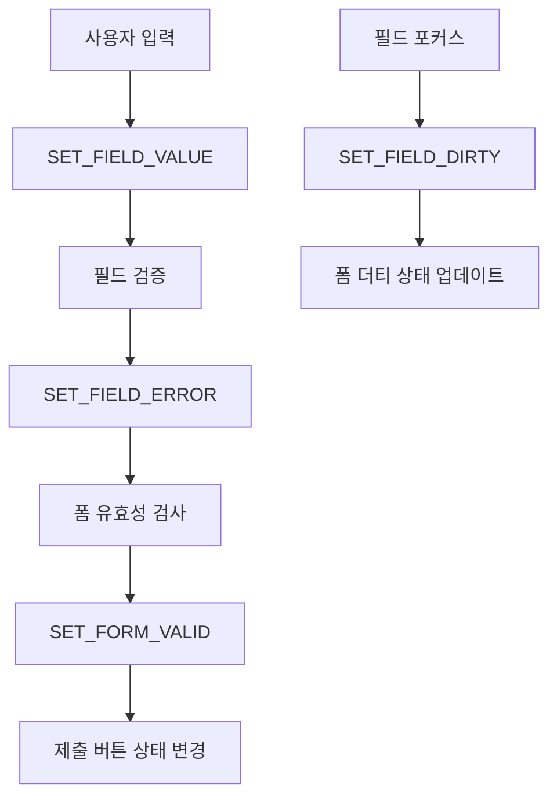
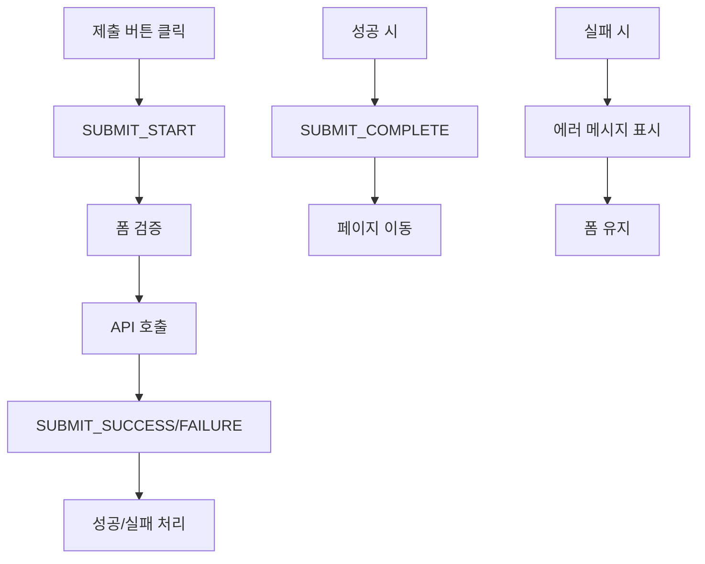
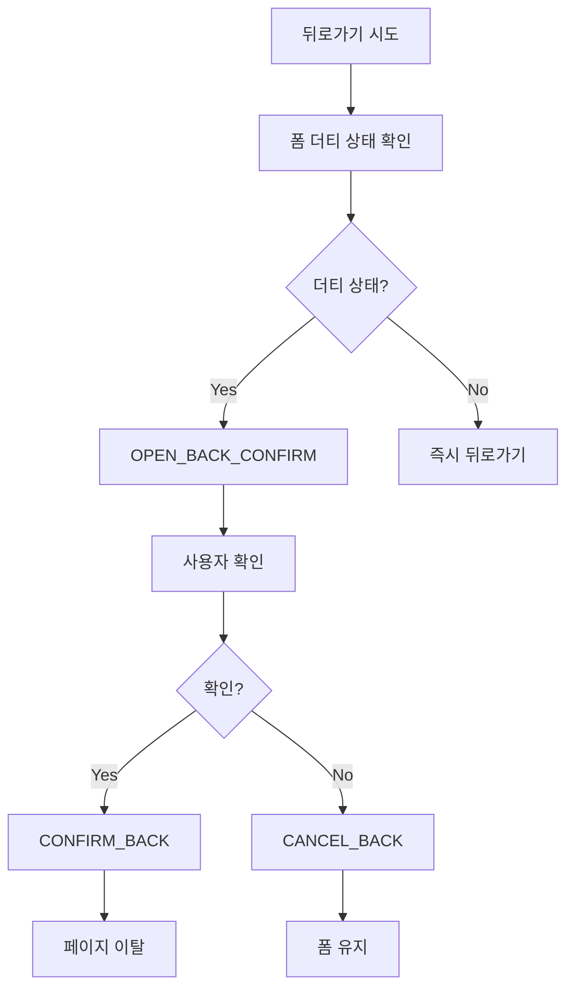
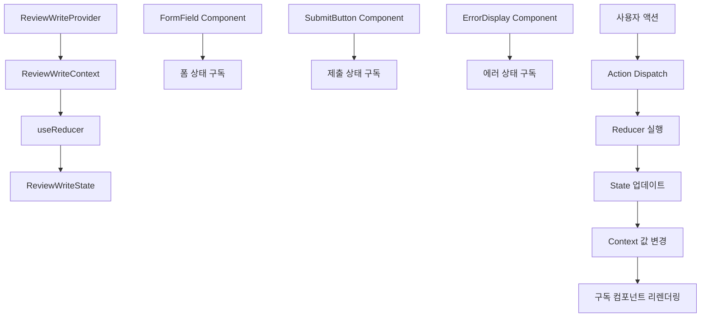
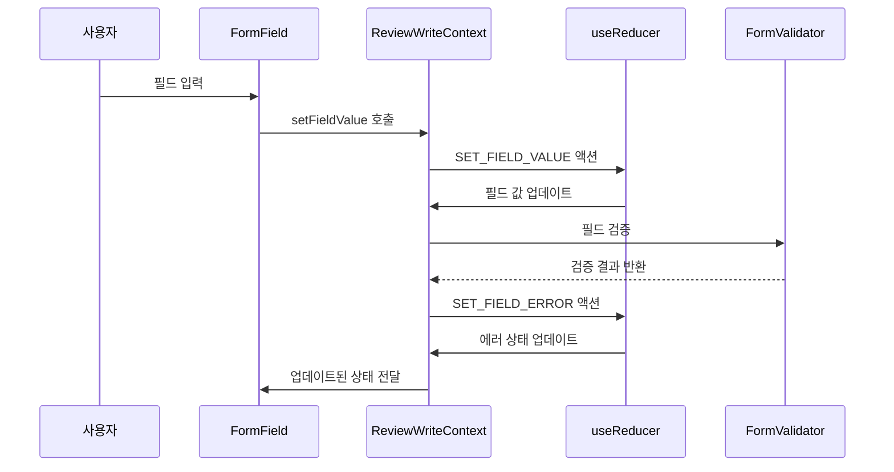
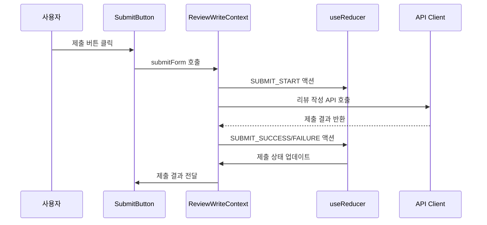
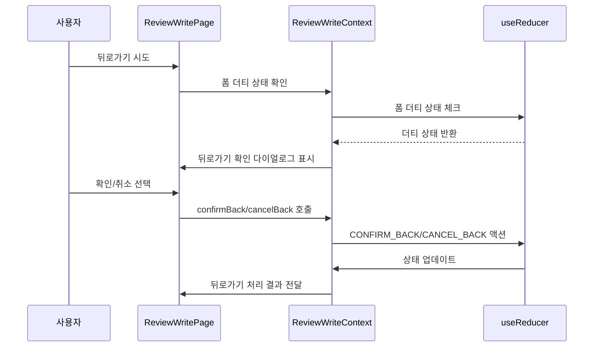

# 리뷰 작성 페이지 상태관리 설계

## 문서 개요
리뷰 작성 페이지에서 폼 상태 관리 및 제출 처리를 위한 상태관리 설계입니다. Context + useReducer 패턴을 사용하여 복잡한 폼 상태를 효율적으로 관리합니다.

---

## 1. 관리해야 할 상태 데이터

### 1.1 폼 데이터 상태
- **작성자명**: `string`
- **평점**: `number`
- **리뷰 내용**: `string`
- **비밀번호**: `string`
- **폼 유효성**: `boolean`
- **폼 더티 상태**: `boolean`

### 1.2 폼 검증 상태
- **작성자명 에러**: `string | null`
- **평점 에러**: `string | null`
- **내용 에러**: `string | null`
- **비밀번호 에러**: `string | null`
- **전체 폼 에러**: `string | null`

### 1.3 제출 상태
- **제출 중**: `boolean`
- **제출 성공**: `boolean`
- **제출 에러**: `string | null`
- **제출 완료**: `boolean`

### 1.4 장소 정보 상태
- **장소 데이터**: `Place | null`
- **장소 로딩**: `boolean`
- **장소 에러**: `string | null`

### 1.5 UI 상태
- **뒤로가기 확인**: `boolean`
- **폼 초기화**: `boolean`
- **자동 저장**: `boolean`

---

## 2. 화면상에 보여지는 데이터지만 상태가 아닌 것

### 2.1 계산된 값들
- **글자 수**: 리뷰 내용 길이
- **남은 글자 수**: 최대 글자 수 - 현재 글자 수
- **평점 별표**: 평점에 따른 별표 표시
- **폼 진행률**: 입력된 필드 수 / 전체 필드 수

### 2.2 외부 데이터
- **URL 파라미터**: Next.js 라우터에서 관리
- **브라우저 히스토리**: 브라우저 API에서 관리
- **로컬 스토리지**: 임시 저장 데이터

---

## 3. 상태 변경 조건 및 화면 변화

| 상태 | 변경 조건 | 화면 변화 |
|------|-----------|-----------|
| `authorName` | 작성자명 입력 | 입력 필드 값 변경 |
| `rating` | 별점 클릭 | 별표 표시 변경 |
| `content` | 리뷰 내용 입력 | 텍스트 영역 값 변경, 글자 수 표시 |
| `password` | 비밀번호 입력 | 비밀번호 필드 값 변경 |
| `formValid` | 모든 필드 유효성 검사 | 제출 버튼 활성화/비활성화 |
| `formDirty` | 필드 입력 시작 | 뒤로가기 확인 다이얼로그 표시 |
| `authorNameError` | 작성자명 검증 실패 | 에러 메시지 표시 |
| `ratingError` | 평점 선택 안함 | 에러 메시지 표시 |
| `contentError` | 내용 길이 부족/초과 | 에러 메시지 표시 |
| `passwordError` | 비밀번호 길이 부족 | 에러 메시지 표시 |
| `submitting` | 폼 제출 시작 | 제출 버튼 로딩 상태 |
| `submitSuccess` | 제출 성공 | 성공 메시지 표시, 페이지 이동 |
| `submitError` | 제출 실패 | 에러 메시지 표시 |
| `placeData` | 장소 API 응답 | 장소 정보 카드 표시 |
| `placeLoading` | 장소 API 호출 | 장소 로딩 스피너 표시/숨김 |
| `placeError` | 장소 API 에러 | 에러 메시지 표시 |
| `backConfirm` | 뒤로가기 시도 | 확인 다이얼로그 표시/숨김 |

---

## 4. Flux 패턴 시각화

### 4.1 폼 입력 상태 관리 플로우



### 4.2 폼 제출 상태 관리 플로우



### 4.3 뒤로가기 처리 플로우



---

## 5. Context 구조 및 노출 변수/함수

### 5.1 ReviewWriteContext 구조

```typescript
interface ReviewWriteContextType {
  // 상태
  state: ReviewWriteState;
  
  // 폼 데이터 액션
  setAuthorName: (name: string) => void;
  setRating: (rating: number) => void;
  setContent: (content: string) => void;
  setPassword: (password: string) => void;
  resetForm: () => void;
  
  // 폼 검증 액션
  validateField: (field: FormField) => void;
  validateForm: () => boolean;
  clearFieldError: (field: FormField) => void;
  clearAllErrors: () => void;
  
  // 폼 제출 액션
  submitForm: () => Promise<void>;
  resetSubmitState: () => void;
  
  // 장소 정보 액션
  fetchPlace: (placeId: string) => Promise<void>;
  clearPlace: () => void;
  
  // UI 상태 액션
  openBackConfirm: () => void;
  closeBackConfirm: () => void;
  confirmBack: () => void;
  cancelBack: () => void;
  
  // 유틸리티 함수
  resetState: () => void;
  getFormProgress: () => number;
  getCharacterCount: () => number;
  getRemainingCharacters: () => number;
  isFormDirty: () => boolean;
}
```

### 5.2 하위 컴포넌트에 노출되는 변수

```typescript
// 폼 컴포넌트에서 사용
const {
  state: { authorName, rating, content, password, formValid, formDirty },
  setAuthorName,
  setRating,
  setContent,
  setPassword,
  validateField,
  validateForm
} = useReviewWriteContext();

// 에러 표시 컴포넌트에서 사용
const {
  state: { authorNameError, ratingError, contentError, passwordError },
  clearFieldError,
  clearAllErrors
} = useReviewWriteContext();

// 제출 버튼 컴포넌트에서 사용
const {
  state: { submitting, submitSuccess, submitError },
  submitForm,
  resetSubmitState
} = useReviewWriteContext();

// 장소 정보 컴포넌트에서 사용
const {
  state: { placeData, placeLoading, placeError },
  fetchPlace
} = useReviewWriteContext();
```

---

## 6. Context 데이터 흐름 시각화

### 6.1 전체 데이터 흐름



### 6.2 폼 입력 흐름



### 6.3 폼 제출 흐름



### 6.4 뒤로가기 처리 흐름



---

## 7. Action 타입 정의

### 7.1 폼 데이터 관련 액션

```typescript
type FormDataAction =
  | { type: 'SET_AUTHOR_NAME'; payload: string }
  | { type: 'SET_RATING'; payload: number }
  | { type: 'SET_CONTENT'; payload: string }
  | { type: 'SET_PASSWORD'; payload: string }
  | { type: 'RESET_FORM' }
  | { type: 'SET_FORM_DIRTY'; payload: boolean };
```

### 7.2 폼 검증 관련 액션

```typescript
type FormValidationAction =
  | { type: 'SET_AUTHOR_NAME_ERROR'; payload: string | null }
  | { type: 'SET_RATING_ERROR'; payload: string | null }
  | { type: 'SET_CONTENT_ERROR'; payload: string | null }
  | { type: 'SET_PASSWORD_ERROR'; payload: string | null }
  | { type: 'SET_FORM_VALID'; payload: boolean }
  | { type: 'CLEAR_FIELD_ERROR'; payload: FormField }
  | { type: 'CLEAR_ALL_ERRORS' };
```

### 7.3 폼 제출 관련 액션

```typescript
type FormSubmitAction =
  | { type: 'SUBMIT_START' }
  | { type: 'SUBMIT_SUCCESS' }
  | { type: 'SUBMIT_FAILURE'; payload: string }
  | { type: 'SUBMIT_COMPLETE' }
  | { type: 'RESET_SUBMIT_STATE' };
```

### 7.4 장소 정보 관련 액션

```typescript
type PlaceAction =
  | { type: 'FETCH_PLACE_START' }
  | { type: 'FETCH_PLACE_SUCCESS'; payload: Place }
  | { type: 'FETCH_PLACE_FAILURE'; payload: string }
  | { type: 'CLEAR_PLACE' };
```

### 7.5 UI 상태 관련 액션

```typescript
type UIAction =
  | { type: 'OPEN_BACK_CONFIRM' }
  | { type: 'CLOSE_BACK_CONFIRM' }
  | { type: 'CONFIRM_BACK' }
  | { type: 'CANCEL_BACK' };
```

---

## 8. Reducer 구현 구조

### 8.1 초기 상태

```typescript
const initialState: ReviewWriteState = {
  // 폼 데이터 상태
  authorName: '',
  rating: 0,
  content: '',
  password: '',
  formValid: false,
  formDirty: false,
  
  // 폼 검증 상태
  authorNameError: null,
  ratingError: null,
  contentError: null,
  passwordError: null,
  formError: null,
  
  // 제출 상태
  submitting: false,
  submitSuccess: false,
  submitError: null,
  submitComplete: false,
  
  // 장소 정보 상태
  placeData: null,
  placeLoading: false,
  placeError: null,
  
  // UI 상태
  backConfirm: false
};
```

### 8.2 Reducer 함수 구조

```typescript
function reviewWriteReducer(
  state: ReviewWriteState,
  action: ReviewWriteAction
): ReviewWriteState {
  switch (action.type) {
    case 'SET_AUTHOR_NAME':
      return { 
        ...state, 
        authorName: action.payload,
        formDirty: true
      };
    
    case 'SET_RATING':
      return { 
        ...state, 
        rating: action.payload,
        formDirty: true
      };
    
    case 'SET_CONTENT':
      return { 
        ...state, 
        content: action.payload,
        formDirty: true
      };
    
    case 'SET_PASSWORD':
      return { 
        ...state, 
        password: action.payload,
        formDirty: true
      };
    
    case 'SUBMIT_START':
      return { 
        ...state, 
        submitting: true,
        submitError: null
      };
    
    case 'SUBMIT_SUCCESS':
      return { 
        ...state, 
        submitting: false,
        submitSuccess: true,
        submitComplete: true
      };
    
    case 'SUBMIT_FAILURE':
      return { 
        ...state, 
        submitting: false,
        submitError: action.payload
      };
    
    // ... 기타 액션들
    
    default:
      return state;
  }
}
```

---

## 9. 성능 최적화 고려사항

### 9.1 메모이제이션
- `useMemo`로 계산된 값 메모이제이션
- `useCallback`으로 액션 함수 메모이제이션
- `React.memo`로 불필요한 리렌더링 방지

### 9.2 디바운싱
- 폼 입력 시 실시간 검증 디바운싱
- 자동 저장 기능 디바운싱

### 9.3 지연 로딩
- 장소 정보 지연 로딩
- 컴포넌트 지연 로딩

### 9.4 로컬 스토리지
- 임시 저장 기능으로 사용자 입력 보존
- 페이지 새로고침 시 데이터 복원

---

## 10. 테스트 전략

### 10.1 단위 테스트
- Reducer 함수 테스트
- 액션 크리에이터 테스트
- Context 훅 테스트

### 10.2 통합 테스트
- 폼 입력 플로우 테스트
- 폼 제출 플로우 테스트
- 뒤로가기 처리 테스트

### 10.3 E2E 테스트
- 사용자 시나리오 기반 테스트
- 폼 작성/제출 테스트

---

## 11. 확장성 고려사항

### 11.1 미래 기능 추가
- 이미지 업로드 기능
- 자동 저장 기능
- 폼 템플릿 기능

### 11.2 상태 구조 확장
- 새로운 폼 필드 추가
- 검증 규칙 확장
- UI 상태 확장

---

## 12. 변경 이력

| 버전 | 날짜 | 작성자 | 변경 내용 |
|------|------|--------|-----------|
| 1.0 | 2025-10-21 | AI Agent | 초기 작성 |

---

**문서 작성 완료**

이 설계는 리뷰 작성 페이지의 복잡한 폼 상태를 효율적으로 관리하기 위한 Context + useReducer 패턴을 기반으로 합니다. 폼 데이터, 검증, 제출, UI 상태를 명확히 분리하고, 각 상태의 변경 조건과 화면 변화를 체계적으로 정의했습니다.
