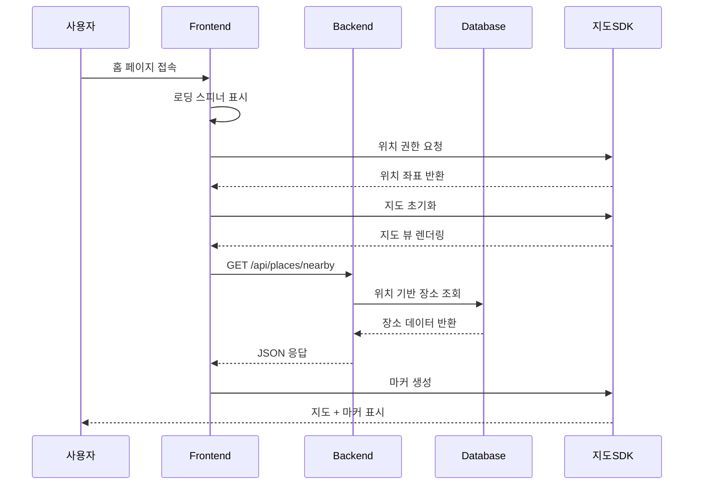

# 유스케이스 ID: UC-001

## 제목
홈 화면에서 지도 기반 장소 탐색

---

## 1. 개요

### 1.1 목적
사용자가 현재 위치를 중심으로 지도에서 주변 맛집을 탐색하고, 리뷰가 있는 장소를 시각적으로 확인할 수 있도록 한다.

### 1.2 범위
- 지도 초기 로딩 및 현재 위치 감지
- 지도 인터랙션 (드래그, 줌)
- 장소 마커 표시 및 클릭
- 검색 바 활용

### 1.3 액터
- **주요 액터**: 사용자 (비로그인)
- **부 액터**: 브라우저 (Geolocation API), 지도 SDK

---

## 2. 선행 조건

- 사용자가 홈 페이지 URL(`/`)에 접속
- 브라우저가 Geolocation API를 지원
- 지도 SDK가 로드됨
- 네트워크 연결 상태

---

## 3. 참여 컴포넌트

- **Frontend**: React 컴포넌트 (PlaceMap, SearchBar)
- **Backend**: Hono API 서버
- **Database**: Supabase (places, reviews 테이블)
- **External**: 지도 SDK (Kakao Map 또는 Naver Map)

---

## 4. 기본 플로우 (Basic Flow)

### 4.1 단계별 흐름

1. **사용자**: 홈 페이지 접속
   - 입력: URL `/`
   - 처리: 페이지 컴포넌트 마운트
   - 출력: 로딩 스피너 표시

2. **Frontend**: 현재 위치 조회 시도
   - 입력: Geolocation API 호출
   - 처리: 위치 권한 요청
   - 출력: 위치 좌표 또는 권한 거부

3. **Frontend**: 지도 초기화
   - 입력: 위치 좌표 (또는 기본 위치)
   - 처리: 지도 SDK 초기화
   - 출력: 지도 뷰 렌더링

4. **Frontend**: 주변 장소 조회
   - 입력: 현재 위치 좌표
   - 처리: API 호출 `GET /api/places/nearby`
   - 출력: 리뷰가 있는 장소 목록

5. **Backend**: 데이터베이스 조회
   - 입력: 위치 기반 쿼리
   - 처리: places와 reviews 테이블 JOIN
   - 출력: 장소 데이터 반환

6. **Frontend**: 마커 표시
   - 입력: 장소 데이터
   - 처리: 지도에 마커 생성
   - 출력: 시각적 마커 표시

### 4.2 시퀀스 다이어그램

---

## 5. 대안 플로우 (Alternative Flows)

### 5.1 대안 플로우 1: 위치 권한 거부

**시작 조건**: 사용자가 위치 권한을 거부한 경우

**단계**:
1. 기본 위치(서울시청)로 설정
2. 안내 메시지 표시
3. 지도 초기화 진행

**결과**: 기본 위치 중심의 지도 표시

### 5.2 대안 플로우 2: 위치 조회 실패

**시작 조건**: Geolocation API 호출 실패

**단계**:
1. 에러 로깅
2. 기본 위치로 폴백
3. 지도 초기화 진행

**결과**: 기본 위치 중심의 지도 표시

---

## 6. 예외 플로우 (Exception Flows)

### 6.1 예외 상황 1: 네트워크 오류

**발생 조건**: API 호출 중 네트워크 연결 실패

**처리 방법**:
1. 에러 메시지 표시
2. 재시도 버튼 제공
3. 오프라인 상태 안내

**에러 코드**: `NETWORK_ERROR` (HTTP 500)

**사용자 메시지**: "네트워크 연결을 확인해주세요"

### 6.2 예외 상황 2: 지도 SDK 로딩 실패

**발생 조건**: 지도 SDK 초기화 실패

**처리 방법**:
1. 에러 바운더리로 처리
2. 재로딩 버튼 제공
3. 대체 UI 표시

**에러 코드**: `MAP_LOAD_ERROR`

**사용자 메시지**: "지도를 불러올 수 없습니다"

---

## 7. 후행 조건 (Post-conditions)

### 7.1 성공 시

- **데이터베이스 변경**: 없음 (조회만 수행)
- **시스템 상태**: 지도 뷰 활성화, 마커 표시
- **외부 시스템**: 지도 SDK 초기화 완료

### 7.2 실패 시

- **데이터 롤백**: 없음
- **시스템 상태**: 에러 상태, 재시도 가능

---

## 8. 비기능 요구사항

### 8.1 성능
- 지도 로딩 시간: 3초 이내
- 마커 렌더링: 1초 이내
- API 응답 시간: 2초 이내

### 8.2 보안
- 위치 정보는 클라이언트에서만 처리
- 서버로 위치 정보 전송 시 HTTPS 사용

### 8.3 가용성
- 지도 SDK 장애 시 대체 UI 제공
- 네트워크 불안정 시 재시도 메커니즘

---

## 9. UI/UX 요구사항

### 9.1 화면 구성
- 전체 화면 지도 뷰
- 상단 고정 검색 바
- 현재 위치 마커 (고유 아이콘)
- 장소 마커 (리뷰 존재 장소)
- 지도 컨트롤 버튼

### 9.2 사용자 경험
- 직관적인 지도 조작
- 부드러운 드래그/줌 애니메이션
- 마커 클릭 시 즉시 반응

---

## 10. 테스트 시나리오

### 10.1 성공 케이스

| 테스트 케이스 ID | 입력값 | 기대 결과 |
|----------------|--------|----------|
| TC-001-01 | 정상 위치 권한 | 지도 로딩, 마커 표시 |
| TC-001-02 | 위치 권한 거부 | 기본 위치로 지도 표시 |

### 10.2 실패 케이스

| 테스트 케이스 ID | 입력값 | 기대 결과 |
|----------------|--------|----------|
| TC-001-03 | 네트워크 오류 | 에러 메시지, 재시도 버튼 |
| TC-001-04 | 지도 SDK 오류 | 에러 바운더리, 재로딩 |

---

## 11. 관련 유스케이스

- **후행 유스케이스**: UC-002 (장소 검색 결과), UC-003 (장소 상세 페이지)
- **연관 유스케이스**: UC-002 (검색 기능)

---

## 12. 변경 이력

| 버전 | 날짜 | 작성자 | 변경 내용 |
|------|------|--------|-----------|
| 1.0  | 2025-10-21 | AI Agent | 초기 작성 |

---

## 부록

### A. 용어 정의
- **마커**: 지도상의 장소를 나타내는 시각적 요소
- **현재 위치**: 사용자의 GPS 좌표
- **주변 장소**: 반경 1km 내의 장소

### B. 참고 자료
- [PRD 문서](../prd.md)
- [Userflow 문서](../userflow.md)
- [Database 설계](../database.md)
