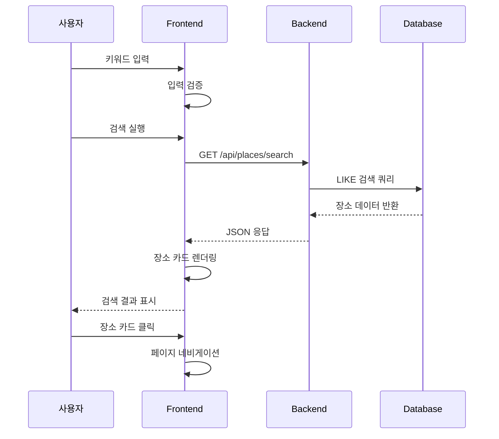

# 유스케이스 ID: UC-002

## 제목
키워드 기반 장소 검색 및 결과 표시

---

## 1. 개요

### 1.1 목적
사용자가 키워드를 입력하여 원하는 맛집을 검색하고, 검색 결과를 카드 형태로 표시하여 장소 정보를 확인하고 리뷰 작성으로 이동할 수 있도록 한다.

### 1.2 범위
- 검색 키워드 입력 및 검증
- 검색 결과 조회 및 표시
- 장소 카드 인터랙션
- 무한 스크롤/페이지네이션
- 검색 결과 닫기

### 1.3 액터
- **주요 액터**: 사용자 (비로그인)
- **부 액터**: 검색 엔진, 데이터베이스

---

## 2. 선행 조건

- 사용자가 홈 화면에서 검색 바에 키워드 입력
- 네트워크 연결 상태
- 검색 키워드가 1자 이상 입력됨

---

## 3. 참여 컴포넌트

- **Frontend**: React 컴포넌트 (SearchBar, PlaceSearchModal, PlaceCard)
- **Backend**: Hono API 서버
- **Database**: Supabase (places 테이블)
- **External**: 없음

---

## 4. 기본 플로우 (Basic Flow)

### 4.1 단계별 흐름

1. **사용자**: 검색 키워드 입력
   - 입력: 검색 바에 텍스트 입력
   - 처리: 실시간 입력 검증
   - 출력: 유효성 피드백

2. **사용자**: 검색 실행
   - 입력: 엔터 키 또는 검색 버튼 클릭
   - 처리: 키워드 trim 및 검증
   - 출력: 검색 결과 페이지로 이동

3. **Frontend**: 검색 API 호출
   - 입력: 검색 키워드
   - 처리: `GET /api/places/search?q={keyword}`
   - 출력: 로딩 상태 표시

4. **Backend**: 데이터베이스 검색
   - 입력: 검색 쿼리
   - 처리: places 테이블 LIKE 검색
   - 출력: 매칭되는 장소 목록

5. **Frontend**: 검색 결과 표시
   - 입력: 장소 데이터 배열
   - 처리: 장소 카드 리스트 렌더링
   - 출력: 검색 결과 UI 표시

6. **사용자**: 장소 카드 클릭
   - 입력: 특정 장소 카드 클릭
   - 처리: 장소 상세 페이지로 네비게이션
   - 출력: 페이지 이동

### 4.2 시퀀스 다이어그램

---

## 5. 대안 플로우 (Alternative Flows)

### 5.1 대안 플로우 1: 검색 결과 없음

**시작 조건**: 검색 키워드에 매칭되는 장소가 없는 경우

**단계**:
1. 빈 상태 UI 표시
2. 안내 메시지 표시
3. 홈으로 돌아가기 버튼 제공

**결과**: 빈 상태 메시지와 함께 UI 표시

### 5.2 대안 플로우 2: 리뷰 작성 버튼 클릭

**시작 조건**: 사용자가 장소 카드의 "리뷰 작성" 버튼 클릭

**단계**:
1. 장소 ID 추출
2. 리뷰 작성 페이지로 직접 이동
3. 장소 정보 전달

**결과**: 리뷰 작성 페이지로 이동

---

## 6. 예외 플로우 (Exception Flows)

### 6.1 예외 상황 1: 네트워크 오류

**발생 조건**: API 호출 중 네트워크 연결 실패

**처리 방법**:
1. 에러 메시지 표시
2. 재시도 버튼 제공
3. 오프라인 상태 안내

**에러 코드**: `NETWORK_ERROR` (HTTP 500)

**사용자 메시지**: "검색 중 오류가 발생했습니다"

### 6.2 예외 상황 2: 잘못된 키워드

**발생 조건**: 특수문자만 입력하거나 공백만 입력

**처리 방법**:
1. 입력 제한 또는 에러 메시지
2. 검색 실행 차단
3. 올바른 입력 안내

**에러 코드**: `INVALID_QUERY`

**사용자 메시지**: "검색어를 올바르게 입력해주세요"

---

## 7. 후행 조건 (Post-conditions)

### 7.1 성공 시

- **데이터베이스 변경**: 없음 (조회만 수행)
- **시스템 상태**: 검색 결과 표시
- **외부 시스템**: 없음

### 7.2 실패 시

- **데이터 롤백**: 없음
- **시스템 상태**: 에러 상태, 재시도 가능

---

## 8. 비기능 요구사항

### 8.1 성능
- 검색 응답 시간: 2초 이내
- 결과 렌더링: 1초 이내
- 무한 스크롤: 부드러운 로딩

### 8.2 보안
- SQL 인젝션 방지 (파라미터화된 쿼리)
- XSS 방지 (입력값 이스케이프)

### 8.3 가용성
- 검색 서비스 99% 가용성
- 장애 시 대체 검색 방법 제공

---

## 9. UI/UX 요구사항

### 9.1 화면 구성
- 검색 결과 제목
- 닫기 버튼 (X 아이콘)
- 장소 카드 리스트
- 무한 스크롤 로딩 인디케이터
- 결과 개수 표시

### 9.2 사용자 경험
- 실시간 검색 제안 (선택적)
- 부드러운 스크롤 애니메이션
- 직관적인 카드 디자인
- 명확한 액션 버튼

---

## 10. 테스트 시나리오

### 10.1 성공 케이스

| 테스트 케이스 ID | 입력값 | 기대 결과 |
|----------------|--------|----------|
| TC-002-01 | "이차돌" | 매칭되는 장소 목록 표시 |
| TC-002-02 | "스타벅스" | 카페 장소들 표시 |

### 10.2 실패 케이스

| 테스트 케이스 ID | 입력값 | 기대 결과 |
|----------------|--------|----------|
| TC-002-03 | "" (빈 문자열) | 검색 실행 차단 |
| TC-002-04 | "존재하지않는가게" | 빈 상태 메시지 |

---

## 11. 관련 유스케이스

- **선행 유스케이스**: UC-001 (홈 화면)
- **후행 유스케이스**: UC-003 (장소 상세 페이지), UC-004 (리뷰 작성 페이지)
- **연관 유스케이스**: UC-001 (검색 기능)

---

## 12. 변경 이력

| 버전 | 날짜 | 작성자 | 변경 내용 |
|------|------|--------|-----------|
| 1.0  | 2025-10-21 | AI Agent | 초기 작성 |

---

## 부록

### A. 용어 정의
- **키워드**: 사용자가 입력한 검색어
- **LIKE 검색**: 부분 문자열 매칭 검색
- **무한 스크롤**: 스크롤 시 자동으로 추가 데이터 로드

### B. 참고 자료
- [PRD 문서](../prd.md)
- [Userflow 문서](../userflow.md)
- [Database 설계](../database.md)
