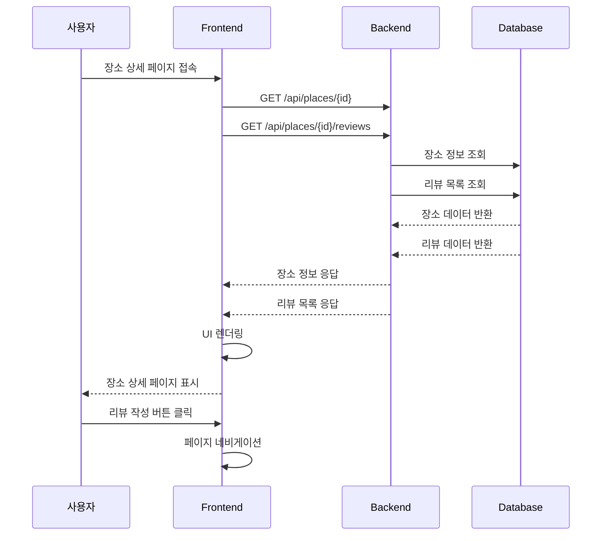

# 유스케이스 ID: UC-003

## 제목
장소 상세 정보 조회 및 리뷰 목록 표시

---

## 1. 개요

### 1.1 목적
사용자가 특정 장소의 상세 정보를 확인하고, 해당 장소의 리뷰 목록을 조회하여 평점과 리뷰 내용을 파악할 수 있도록 한다.

### 1.2 범위
- 장소 기본 정보 표시
- 평점 요약 정보 표시
- 리뷰 목록 조회 및 표시
- 리뷰 작성 버튼 제공
- 리뷰 페이지네이션
- 본인 리뷰 수정/삭제

### 1.3 액터
- **주요 액터**: 사용자 (비로그인)
- **부 액터**: 리뷰 작성자 (비밀번호 기반 인증)

---

## 2. 선행 조건

- 사용자가 장소 ID를 포함한 URL(`/place/{id}`)에 접속
- 해당 장소가 데이터베이스에 존재
- 네트워크 연결 상태

---

## 3. 참여 컴포넌트

- **Frontend**: React 컴포넌트 (PlaceDetailPage, ReviewList, RatingSummary)
- **Backend**: Hono API 서버
- **Database**: Supabase (places, reviews 테이블)
- **External**: 없음

---

## 4. 기본 플로우 (Basic Flow)

### 4.1 단계별 흐름

1. **사용자**: 장소 상세 페이지 접속
   - 입력: URL `/place/{placeId}`
   - 처리: URL 파라미터 추출
   - 출력: 페이지 로딩 시작

2. **Frontend**: 병렬 API 호출
   - 입력: 장소 ID
   - 처리: 두 개의 API 동시 호출
     - `GET /api/places/{placeId}` (장소 정보)
     - `GET /api/places/{placeId}/reviews` (리뷰 목록)
   - 출력: 로딩 상태 표시

3. **Backend**: 장소 정보 조회
   - 입력: 장소 ID
   - 처리: places 테이블 조회 + 평균 평점 계산
   - 출력: 장소 정보 + 평점 요약

4. **Backend**: 리뷰 목록 조회
   - 입력: 장소 ID, 페이지 정보
   - 처리: reviews 테이블 조회 (최신순)
   - 출력: 리뷰 배열 데이터

5. **Frontend**: 데이터 표시
   - 입력: 장소 정보 + 리뷰 목록
   - 처리: UI 컴포넌트 렌더링
   - 출력: 장소 상세 페이지 표시

6. **사용자**: 리뷰 작성 버튼 클릭
   - 입력: "리뷰 작성" 버튼 클릭
   - 처리: 리뷰 작성 페이지로 네비게이션
   - 출력: 페이지 이동

### 4.2 시퀀스 다이어그램

---

## 5. 대안 플로우 (Alternative Flows)

### 5.1 대안 플로우 1: 리뷰 없음

**시작 조건**: 해당 장소에 등록된 리뷰가 없는 경우

**단계**:
1. 빈 상태 UI 표시
2. "등록된 리뷰가 없습니다" 메시지
3. 첫 리뷰 작성 유도 버튼 표시

**결과**: 빈 상태 메시지와 함께 UI 표시

### 5.2 대안 플로우 2: 본인 리뷰 수정/삭제

**시작 조건**: 사용자가 본인이 작성한 리뷰의 수정/삭제 버튼 클릭

**단계**:
1. 비밀번호 입력 모달 표시
2. 비밀번호 검증 API 호출
3. 검증 성공 시 수정 폼 또는 삭제 확인
4. 수정/삭제 처리

**결과**: 리뷰 수정 또는 삭제 완료

---

## 6. 예외 플로우 (Exception Flows)

### 6.1 예외 상황 1: 장소 없음

**발생 조건**: 존재하지 않는 장소 ID로 접속

**처리 방법**:
1. 404 에러 처리
2. "장소를 찾을 수 없습니다" 메시지
3. 홈으로 돌아가기 버튼 제공

**에러 코드**: `PLACE_NOT_FOUND` (HTTP 404)

**사용자 메시지**: "장소를 찾을 수 없습니다"

### 6.2 예외 상황 2: 네트워크 오류

**발생 조건**: API 호출 중 네트워크 연결 실패

**처리 방법**:
1. 에러 메시지 표시
2. 재시도 버튼 제공
3. 부분적 데이터라도 표시

**에러 코드**: `NETWORK_ERROR` (HTTP 500)

**사용자 메시지**: "정보를 불러오는 중 오류가 발생했습니다"

### 6.3 예외 상황 3: 비밀번호 불일치

**발생 조건**: 리뷰 수정/삭제 시 비밀번호가 틀림

**처리 방법**:
1. 에러 메시지 표시
2. 비밀번호 재입력 요청
3. 모달 유지

**에러 코드**: `INVALID_PASSWORD`

**사용자 메시지**: "비밀번호가 일치하지 않습니다"

---

## 7. 후행 조건 (Post-conditions)

### 7.1 성공 시

- **데이터베이스 변경**: 없음 (조회만 수행)
- **시스템 상태**: 장소 상세 정보 표시
- **외부 시스템**: 없음

### 7.2 실패 시

- **데이터 롤백**: 없음
- **시스템 상태**: 에러 상태, 재시도 가능

---

## 8. 비기능 요구사항

### 8.1 성능
- 페이지 로딩 시간: 3초 이내
- 리뷰 목록 로딩: 2초 이내
- 페이지네이션: 부드러운 스크롤

### 8.2 보안
- 비밀번호 해싱 (bcrypt)
- SQL 인젝션 방지
- XSS 방지 (리뷰 내용 이스케이프)

### 8.3 가용성
- 장소 정보 서비스 99% 가용성
- 리뷰 조회 서비스 99% 가용성

---

## 9. UI/UX 요구사항

### 9.1 화면 구성
- 장소 정보 카드 (가게명, 주소, 카테고리)
- 평점 요약 영역 (평균 별점, 리뷰 개수)
- 리뷰 작성 버튼
- 리뷰 리스트 (작성자명, 평점, 내용, 작성일)
- 본인 리뷰 수정/삭제 버튼

### 9.2 사용자 경험
- 직관적인 정보 구조
- 명확한 평점 표시
- 부드러운 스크롤 애니메이션
- 반응형 디자인

---

## 10. 테스트 시나리오

### 10.1 성공 케이스

| 테스트 케이스 ID | 입력값 | 기대 결과 |
|----------------|--------|----------|
| TC-003-01 | 유효한 장소 ID | 장소 정보 + 리뷰 목록 표시 |
| TC-003-02 | 리뷰 있는 장소 | 평점 요약 + 리뷰 리스트 |

### 10.2 실패 케이스

| 테스트 케이스 ID | 입력값 | 기대 결과 |
|----------------|--------|----------|
| TC-003-03 | 존재하지 않는 ID | 404 에러 메시지 |
| TC-003-04 | 잘못된 UUID 형식 | 404 에러 메시지 |

---

## 11. 관련 유스케이스

- **선행 유스케이스**: UC-001 (홈 화면), UC-002 (장소 검색)
- **후행 유스케이스**: UC-004 (리뷰 작성 페이지)
- **연관 유스케이스**: UC-004 (리뷰 수정/삭제)

---

## 12. 변경 이력

| 버전 | 날짜 | 작성자 | 변경 내용 |
|------|------|--------|-----------|
| 1.0  | 2025-10-21 | AI Agent | 초기 작성 |

---

## 부록

### A. 용어 정의
- **평균 평점**: 해당 장소의 모든 리뷰 평점의 평균값
- **리뷰 개수**: 해당 장소에 등록된 총 리뷰 수
- **본인 리뷰**: 비밀번호로 인증된 사용자가 작성한 리뷰

### B. 참고 자료
- [PRD 문서](../prd.md)
- [Userflow 문서](../userflow.md)
- [Database 설계](../database.md)
