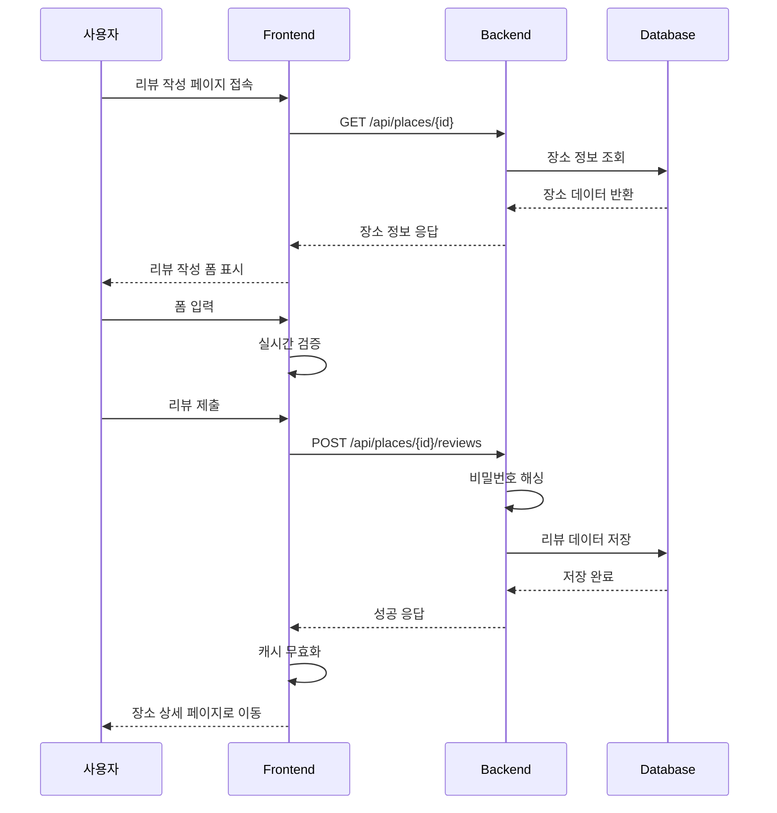

# 유스케이스 ID: UC-004

## 제목
리뷰 작성 및 등록

---

## 1. 개요

### 1.1 목적
사용자가 특정 장소에 대한 리뷰를 작성하고 등록하여, 다른 사용자들이 해당 장소에 대한 정보를 얻을 수 있도록 한다.

### 1.2 범위
- 리뷰 작성 폼 표시
- 폼 입력 및 실시간 검증
- 리뷰 데이터 제출
- 성공/실패 처리
- 뒤로가기/취소 처리

### 1.3 액터
- **주요 액터**: 사용자 (비로그인)
- **부 액터**: 폼 검증 엔진, 데이터베이스

---

## 2. 선행 조건

- 사용자가 리뷰 작성 페이지 URL(`/place/{id}/review`)에 접속
- 해당 장소가 데이터베이스에 존재
- 네트워크 연결 상태

---

## 3. 참여 컴포넌트

- **Frontend**: React 컴포넌트 (ReviewForm, FormField)
- **Backend**: Hono API 서버
- **Database**: Supabase (reviews 테이블)
- **External**: bcrypt (비밀번호 해싱)

---

## 4. 기본 플로우 (Basic Flow)

### 4.1 단계별 흐름

1. **사용자**: 리뷰 작성 페이지 접속
   - 입력: URL `/place/{placeId}/review`
   - 처리: URL 파라미터 추출
   - 출력: 페이지 로딩 시작

2. **Frontend**: 장소 정보 조회
   - 입력: 장소 ID
   - 처리: `GET /api/places/{placeId}` 호출
   - 출력: 장소 기본 정보 표시

3. **Frontend**: 폼 초기화
   - 입력: 장소 정보
   - 처리: react-hook-form + Zod 스키마 연결
   - 출력: 리뷰 작성 폼 표시

4. **사용자**: 폼 입력
   - 입력: 작성자명, 평점, 내용, 비밀번호
   - 처리: 실시간 검증 수행
   - 출력: 유효성 피드백 표시

5. **사용자**: 리뷰 제출
   - 입력: "리뷰 작성하기" 버튼 클릭
   - 처리: 최종 검증 및 API 호출
   - 출력: 로딩 상태 표시

6. **Backend**: 리뷰 등록 처리
   - 입력: 리뷰 데이터
   - 처리: 비밀번호 해싱 + 데이터베이스 저장
   - 출력: 성공 응답 반환

7. **Frontend**: 성공 처리
   - 입력: 성공 응답
   - 처리: 캐시 무효화 + 페이지 이동
   - 출력: 장소 상세 페이지로 이동

### 4.2 시퀀스 다이어그램

---

## 5. 대안 플로우 (Alternative Flows)

### 5.1 대안 플로우 1: 폼 검증 실패

**시작 조건**: 필수 필드가 비어있거나 형식이 잘못된 경우

**단계**:
1. 실시간 에러 메시지 표시
2. 제출 버튼 비활성화
3. 올바른 입력 안내

**결과**: 폼 유지, 재입력 요청

### 5.2 대안 플로우 2: 뒤로가기/취소

**시작 조건**: 사용자가 뒤로가기 버튼 클릭 또는 브라우저 뒤로가기

**단계**:
1. 입력 중인 데이터 확인
2. dirty 상태인 경우 확인 다이얼로그 표시
3. 확인 시 페이지 이탈, 취소 시 폼 유지

**결과**: 이전 페이지로 이동 또는 폼 유지

---

## 6. 예외 플로우 (Exception Flows)

### 6.1 예외 상황 1: 장소 없음

**발생 조건**: 존재하지 않는 장소 ID로 접속

**처리 방법**:
1. 404 에러 처리
2. "장소를 찾을 수 없습니다" 메시지
3. 홈으로 리다이렉트

**에러 코드**: `PLACE_NOT_FOUND` (HTTP 404)

**사용자 메시지**: "장소를 찾을 수 없습니다"

### 6.2 예외 상황 2: 검증 실패

**발생 조건**: 서버에서 Zod 스키마 검증 실패

**처리 방법**:
1. 에러 메시지 표시
2. 폼 유지 (입력값 보존)
3. 재입력 안내

**에러 코드**: `VALIDATION_FAILED` (HTTP 400)

**사용자 메시지**: "입력 정보를 확인해주세요"

### 6.3 예외 상황 3: 데이터베이스 오류

**발생 조건**: 리뷰 저장 중 데이터베이스 오류

**처리 방법**:
1. 에러 메시지 표시
2. 재시도 옵션 제공
3. 폼 유지

**에러 코드**: `REVIEW_CREATE_FAILED` (HTTP 500)

**사용자 메시지**: "리뷰 작성에 실패했습니다. 다시 시도해주세요"

### 6.4 예외 상황 4: 네트워크 오류

**발생 조건**: API 호출 중 네트워크 연결 실패

**처리 방법**:
1. 에러 메시지 표시
2. 재시도 버튼 제공
3. 오프라인 상태 안내

**에러 코드**: `NETWORK_ERROR` (HTTP 500)

**사용자 메시지**: "네트워크 연결을 확인해주세요"

---

## 7. 후행 조건 (Post-conditions)

### 7.1 성공 시

- **데이터베이스 변경**: reviews 테이블에 새 레코드 추가
- **시스템 상태**: 리뷰 작성 완료, 장소 상세 페이지 표시
- **외부 시스템**: 없음

### 7.2 실패 시

- **데이터 롤백**: 없음 (저장되지 않음)
- **시스템 상태**: 에러 상태, 재시도 가능

---

## 8. 비기능 요구사항

### 8.1 성능
- 폼 로딩 시간: 2초 이내
- 제출 응답 시간: 3초 이내
- 실시간 검증: 100ms 이내

### 8.2 보안
- 비밀번호 bcrypt 해싱
- SQL 인젝션 방지
- XSS 방지 (입력값 이스케이프)
- CSRF 방지

### 8.3 가용성
- 리뷰 작성 서비스 99% 가용성
- 장애 시 재시도 메커니즘

---

## 9. UI/UX 요구사항

### 9.1 화면 구성
- 뒤로가기 버튼 + "리뷰 작성" 제목
- 장소 정보 카드 (읽기 전용)
- 리뷰 작성 폼:
  - 작성자명 입력 필드
  - 평점 선택 (별 1~5개)
  - 리뷰 내용 텍스트 영역
  - 비밀번호 입력 필드
- 리뷰 작성하기 버튼

### 9.2 사용자 경험
- 직관적인 폼 레이아웃
- 실시간 검증 피드백
- 명확한 에러 메시지
- 부드러운 애니메이션

---

## 10. 테스트 시나리오

### 10.1 성공 케이스

| 테스트 케이스 ID | 입력값 | 기대 결과 |
|----------------|--------|----------|
| TC-004-01 | 유효한 모든 필드 | 리뷰 등록 성공 |
| TC-004-02 | 최소/최대 길이 입력 | 정상 처리 |

### 10.2 실패 케이스

| 테스트 케이스 ID | 입력값 | 기대 결과 |
|----------------|--------|----------|
| TC-004-03 | 빈 필수 필드 | 검증 에러 메시지 |
| TC-004-04 | 잘못된 이메일 형식 | 이메일 형식 에러 |
| TC-004-05 | 500자 초과 내용 | 길이 제한 에러 |

---

## 11. 관련 유스케이스

- **선행 유스케이스**: UC-001 (홈 화면), UC-002 (장소 검색), UC-003 (장소 상세)
- **후행 유스케이스**: UC-003 (장소 상세 페이지로 복귀)
- **연관 유스케이스**: UC-003 (리뷰 수정/삭제)

---

## 12. 변경 이력

| 버전 | 날짜 | 작성자 | 변경 내용 |
|------|------|--------|-----------|
| 1.0  | 2025-10-21 | AI Agent | 초기 작성 |

---

## 부록

### A. 용어 정의
- **작성자명**: 이메일 형식의 사용자 식별자
- **평점**: 1~5점의 별점 평가
- **비밀번호**: 리뷰 수정/삭제용 인증 수단
- **dirty 상태**: 사용자가 입력을 시작한 폼 상태

### B. 참고 자료
- [PRD 문서](../prd.md)
- [Userflow 문서](../userflow.md)
- [Database 설계](../database.md)
